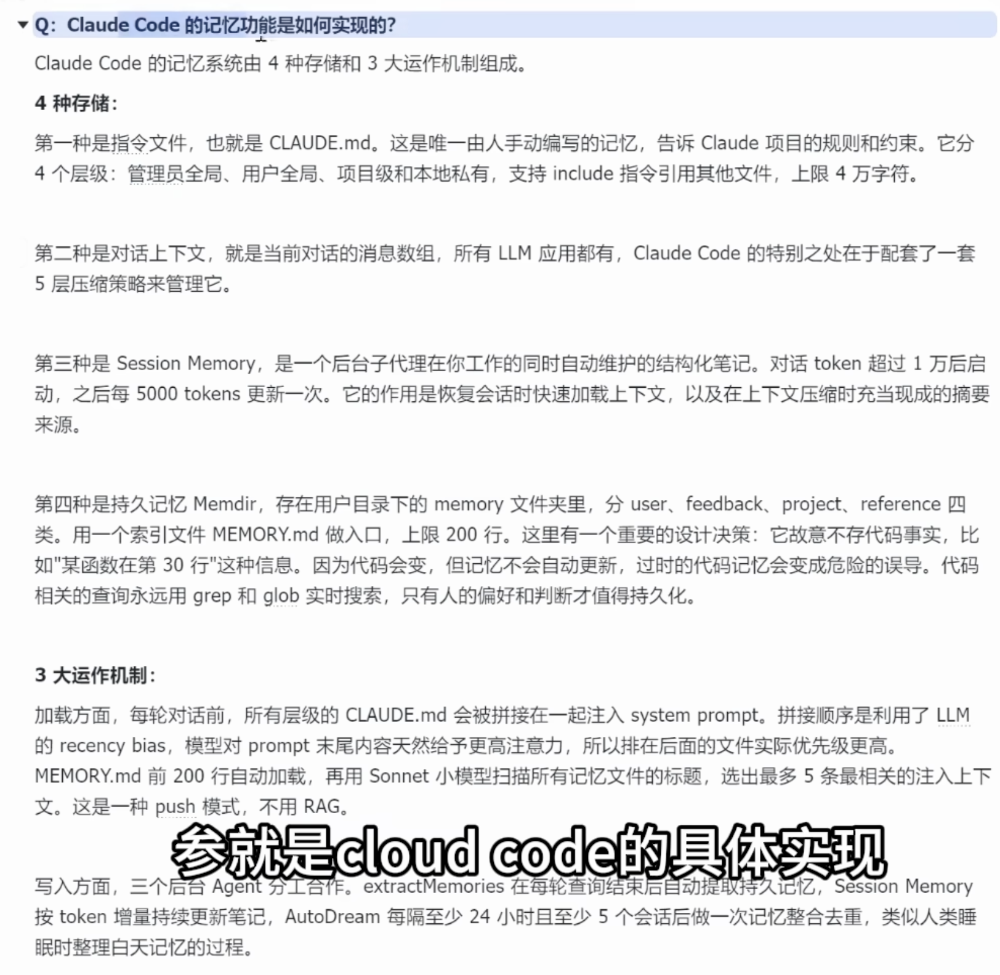
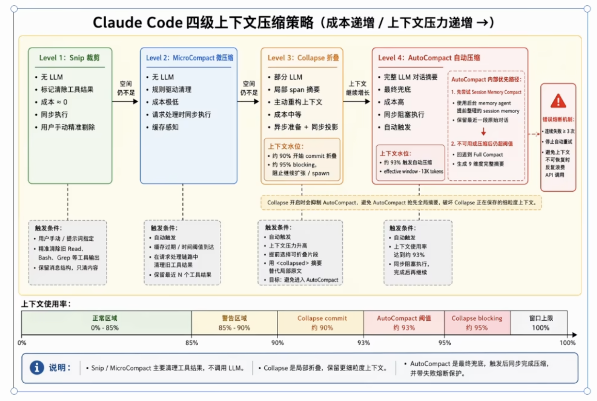

# AI Agent 与 VibeCoding 面试题库：工具使用篇

本指南专门用于梳理和解答与 AI Agent 工具使用相关的面试问题。面试官往往通过这类问题，考察候选人对 AI 工具的深度理解、工程化思维以及是否能够在实际业务中“聪明、高效”地驾驭 AI。

---

## 一、 工具选型与差异对比类

这类问题主要考察候选人是否对不同 AI 编程助手（Agent）的特点有清晰认知，能否根据场景取长补短，避免“一招鲜吃遍天”。

### Q1: 你平时会用什么 VibeCoding (AI 编程) 的工具呢？

#### 💡 考察意图分析
面试官不仅想知道你“用了什么”，更想知道你“怎么用”。这个问题旨在考察：
1. **深度认知**：你对当前主流 AI Agent 编程工具（如 ClaudeCode, Codex 等）特性的了解程度。
2. **取长补短的工程化思维**：你是否具备根据不同工具的优缺点，进行组合调度、高效解决复杂问题的能力。
3. **真实实践**：你的回答是否停留在理论层面，还是有真实的业务场景落地经验。

#### ✅ 优秀回答范例

“在平时的开发和 VibeCoding 过程中，我会同时配合使用 **ClaudeCode** 和 **Codex**。因为它们的底层特性和优缺点存在显著差异，我通常会根据具体的任务场景，取长补短地去调度它们。

**1. 偏重创意、复杂设计与高定制化场景 —— 优先使用 ClaudeCode**
ClaudeCode 在发散性思维和创意性上表现得更加出色。
*   **复杂方案与头脑风暴：** 当我需要进行复杂的架构方案设计、前期的业务逻辑头脑风暴时，我会优先借助 ClaudeCode 的发散与总结能力。
*   **前端审美与设计：** 在涉及到前端开发时，它生成 UI 的设计能力和审美往往更好。
*   **高度定制化工作流 (Workflow)：** 它的可扩展性极强，比如提供了 30+ 个 Hook 的能力。当我需要处理一些特定团队规范的任务，或者需要沉淀、创造自己的开发 Workflow 时，ClaudeCode 是非常好的选择。
    > **💡 深度解析：Hook 的作用、原理与实例分析**
    > *   **基本原理：** Hook（钩子）本质上是一种基于事件驱动的拦截机制。在 AI 工具（如 ClaudeCode）执行任务的全生命周期中（例如：获取上下文前、生成代码后、执行终端命令前、Git 提交前等），系统预设了特定的“挂载点”。开发者可以将自定义的脚本或指令绑定在这些挂载点上。当 AI 的运行链路到达该节点时，就会暂停原有流程，优先触发并执行自定义脚本。
    > *   **核心作用：** Hook 打破了 AI 工具完全“黑盒”和“一条龙”的执行方式，赋予了开发者在自动化流程中强制干预、注入团队规范、校验结果以及动态补充上下文的能力。
    > *   **实例分析（以代码提交规范为例）：** 假设团队要求所有代码必须通过严格的 ESLint 校验才能提交。
    >     *   **配置 Hook：** 开发者在 ClaudeCode 的配置中编写一个挂载于 `pre-commit`（代码提交前）节点的 Hook 脚本，该脚本负责运行 `npm run lint`。
    >     *   **触发执行：** 当 ClaudeCode 自动完成代码编写并尝试执行 `git commit` 时，`pre-commit` Hook 被触发。
    >     *   **阻断与修复闭环：** 如果 AI 生成的代码有规范问题，Lint 脚本会报错并退出（Exit Code 非 0），Hook 成功拦截了这次提交。此时，ClaudeCode 会自动捕获 Lint 的报错日志，基于报错内容进行自我修正，直到代码完全符合规范，顺利通过 Hook 校验，最终完成代码提交。这样就建立了一个无需人工干预的高质量代码产出工作流。

**2. 偏重严谨执行、长时任务与研发全链路自动化 —— 优先选择 Codex**
Codex 的风格则更加严谨，最突出的优势在于其强大的**指令遵循能力 (Instruction Following)**。
*   **长时稳定任务：** 对于一些需要长时间运行、跨多个文件修改、且要求逻辑稳定的任务，我会交给 Codex。因为它更加“听从指挥”，执行过程非常严谨，不易在多轮对话中跑偏。
*   **Git 生态与完整工程链路：** Codex 在 Git 生态的集成和支持上极其好用，它能够很好地覆盖从 `Coding -> Code Review -> Deploy -> Production` 的完整研发链路。
*   **自动化测试与报告：** 例如，Codex 具备自动操作电脑终端来执行 Review 脚本、运行前端/后端测试环境并输出测试报告的能力。针对这类重工程化、偏后期的需求，Codex 是我的主力工具。”

#### ⚠️ 面试避坑与进阶建议
*   **切忌死记硬背（防追问）：** 上述回答体现了比较高的 AI 认知段位。如果你对 Codex 或 ClaudeCode 没有实际的深度使用经验，切忌生搬硬套。面试官极有可能会顺着你的回答追问：“你具体用了 ClaudeCode 的哪个 Hook？” 或者 “Codex 是如何帮你做 Code Review 的？” 如果答不上来，面试官会认为你是背诵的面经。
*   **结合真实案例落地：** 更好的作答方式是在阐述完上述理论后，**主动抛出一个真实案例**。例如：“在最近的一个项目中，我先用 ClaudeCode 讨论出了前端架构并编写了初始化 Hook 脚本，随后交由 Codex 跑完了剩余几百个文件的批量重构和自动化测试链路……” 这样的回答非常具体，且具备极强的说服力。

---

## 二、 场景应用与工作流 (Workflow) 构建类

*(待补充：可以记录更多关于如何结合 AI 工具构建 CI/CD、代码审查规范、自动化测试等相关问题)*

## 三、 问题排查与 Debug 策略类

*(待补充：可以记录当 AI 工具生成错误代码、产生幻觉时，你通常如何使用工具排查和解决等相关问题)*

---

## 四、 工具原理解析与竞品对比类

本模块主要考察候选人是否对业界顶尖 AI 编程工具的底层设计有深入研究，并能将其设计思想与自己的项目实践进行横向对比与印证。

### Q1: Claude Code 的记忆功能是如何实现的？如果将其与你们当前的 Agent 项目对比，有哪些异同和启发？

#### 💡 考察意图分析
这道题是高级别的架构题。面试官希望看到你不仅“会用”工具，还拆解过顶尖产品（如 Claude Code）的底层运行机制。同时，通过对比你们自己的项目，考察你在工程实现上的取舍和思考深度。

#### ✅ 核心回答（Claude Code 的原理解析）

根据 Claude Code 的具体实现，它的记忆系统是由 **4 种存储载体**和 **3 大运作机制**组成的。

**一、 4 种存储载体**
1. **指令文件 (CLAUDE.md)**：这是唯一由人工手动编写的记忆，用于告诉模型项目的全局规则与约束。它分为 4 个层级（管理员全局、用户全局、项目级、本地私有），支持 `include` 指令引用，字符上限 4 万字。
2. **对话上下文 (Chat Context)**：即当前对话的消息数组。特别之处在于，Claude Code 为其配套了一套 **5 层压缩策略**来进行管理，避免 Token 爆炸。
3. **会话记忆 (Session Memory)**：这是一个后台子代理在你工作时**自动维护的结构化笔记**。当对话 Token 超过 1 万时启动，之后每 5000 Token 增量更新一次。它的核心作用是：在恢复会话时快速加载上下文，并在触发上下文压缩时充当现成的“摘要池”。
4. **持久记忆 (Memdir)**：存储在用户本地的 `memory` 文件夹下，分为 user、feedback、project、reference 四类。它以 `MEMORY.md` 作为索引入口，上限 200 行。
   * **⚠️ 核心设计决策**：它**故意不存代码事实**（比如“某函数在第30行”），因为代码是易变的，一旦过时就会变成危险的误导。代码搜索永远通过 `grep` 和 `glob` 实时进行，只有“人的偏好和判断”才值得被持久化。

**二、 3 大运作机制**
1. **加载机制 (Load)**：
   * 在每轮对话前，所有层级的 `CLAUDE.md` 会被拼接并注入 `System Prompt`。拼接顺序利用了 LLM 的 **近因效应 (Recency Bias)**，模型对 Prompt 末尾内容天然给予更高注意力，所以排在后面的文件实际优先级更高。
   * `MEMORY.md` 会自动加载前 200 行，随后**调用 Sonnet 小模型去扫描所有持久记忆文件的标题**，选出最多 5 条最相关的注入上下文。这是典型的 **Push (推送) 模式**，而没有使用常规的 RAG（检索增强生成）。
2. **提取机制 (Extract)**：由 `extractMemories` 后台 Agent 在每轮查询结束后，自动提取值得持久化的经验。
3. **整合机制 (Consolidate)**：由名为 `AutoDream` 的后台 Agent 负责。它每隔至少 24 小时且至少完成 5 个会话后，会进行一次记忆的整合与去重。这非常类似于**人类在睡眠时整理白天记忆的突触修剪过程**。

#### 🚀 进阶实战：结合当前 Code Agent 项目的横向对比与分析

在回答完 Claude Code 的机制后，面试时强烈建议主动结合你们自己开发的项目（Code Agent）进行对比分析，这能极大拉升你的架构视野：

> “在研究了 Claude Code 的架构后，我发现我们团队当前的 Code Agent 项目在记忆设计上，与行业顶尖方案有异曲同工之妙，但在某些技术选型上根据实际需求做了不同的取舍：
> 
> 1. **在上下文压缩策略上**：Claude Code 采用了 5 层压缩策略和 Session 摘要。而我们在项目中设计了 **AST-aware Pruner**（基于 Tree-sitter）。我们不仅依赖文本摘要，更强调在压缩时‘精准保留类的骨架（函数签名）而折叠内部实现血肉’，这对保证代码语义完整性更为有效。
> 2. **在长效记忆的加载模式上（Push vs RAG）**：Claude 放弃了 RAG，选择用小模型扫描标题（Push 模式）；并且同样坚守“绝不把代码事实存入长期记忆”的法则。而我们在项目中设计了**三层记忆流转架构（短期-情景-长期）**，由于要处理复杂的跨项目知识，我们在长期记忆层依然采用了 **Vector DB + Cosine Similarity** 进行 KNN 召回，但存储的同样是深度抽象的规则（Rules）。
> 3. **在后台沉淀机制上（AutoDream vs 异步 Worker）**：Claude 拥有非常有创意的 `AutoDream` 睡眠整理机制。而我们在工程落地时，采用的是**‘同步裁剪 + 异步蒸馏’**的双轨模型。在 Token 触顶时，立刻同步执行 AST 裁剪保底，同时将废弃快照抛给后台 Worker 异步提取（Extractor 引擎），这两种机制的最终目的都是坚决不阻塞用户主线程，保证交互体验的丝滑性。”

### Q2: Claude Code 是如何处理上下文窗口限制的？请详细说明其多级上下文压缩策略。如果对比你们的 Code Agent 项目，有什么异同点？

#### 💡 考察意图分析
这道题是对 Q1 中“5 层压缩策略”的深度追问。面试官意图考察候选人是否对大模型应用中不可避免的 **“上下文窗口爆炸（Token 耗尽）”** 问题有成熟的工程化解决思路。候选人不仅需要讲清楚从低成本到高成本的递进式降级策略，还需要展现出对“水位线（阈值）控制”和“同步/异步权衡”的思考。

#### ✅ 核心回答（Claude Code 四级上下文压缩策略）

为了应对上下文压力，Claude Code 并没有采用单一的粗暴截断，而是设计了一套**成本递增、上下文压力递增的“四级压缩策略”**。随着 Token 水位的升高，系统会梯次触发更重的压缩手段：

**1. Level 1: Snip（手动裁剪）**
*   **机制**：完全不调用 LLM，成本几乎为 0，同步执行。
*   **触发与作用**：由用户手动或提示词指定，精准清除旧的 `Read`、`Bash`、`Grep` 等长文本工具输出。它只清空内容，但保留消息结构，保证对话骨架不被破坏。

**2. Level 2: MicroCompact（微压缩）**
*   **机制**：依然不调用 LLM，成本极低，依靠规则驱动进行清理。在请求处理链路上同步执行。
*   **触发与作用**：自动触发（基于缓存过期或时间阈值）。它会自动清理旧的工具结果，仅仅保留最近的 N 个工具返回结果，属于“轻度保底”动作。

**3. Level 3: Collapse（局部折叠）**
*   **机制**：开始引入部分 LLM 成本。这是一个**异步准备 + 同步投影**的过程，主动重构上下文。
*   **触发与水位**：
    *   当上下文水位达到 **约 90%** 时，触发 `Collapse commit`。
    *   当水位达到 **约 95%** 时，触发 `Collapse blocking`（阻止继续扩展 / spawn）。
*   **作用**：它会提前选择可折叠的片段，用一个局部的小摘要 `<collapsed>` 标签来替代长长的原文。这一步的核心目标是：**尽量阻止系统进入成本极高的 AutoCompact（第四级）**。

**4. Level 4: AutoCompact（全局自动压缩）**
*   **机制**：调用完整 LLM 对对话进行全局摘要，成本极高。执行时会**同步阻塞**当前的主线程，这是最终的兜底手段。
*   **触发与水位**：当水位触及 **约 93%** 时自动触发（它会在 95% 阻塞之前被拉起）。
*   **内部优先路径设计**：
    1.  **优先尝试 Session Memory Compact**：尝试利用后台 Agent 提前整理好的 Session 结构化笔记，保留最近一段的原始对话，从而实现压缩。
    2.  **后备回退（Fallback）**：如果 Session Memory 不可用或压缩后依然超标，则回退到 `Full Compact`（生成 9 个维度的完整全局摘要）。
*   **熔断保护**：为了防止 API 额度被无限制吸干，如果连续失败 3 次，系统会触发**错误熔断机制**，停止自动重试。
*   *注意点：当 Level 3（Collapse）开启时，会主动抑制 AutoCompact，防止全局压缩把局部刚刚保留的细粒度上下文破坏掉。*

#### 🚀 进阶实战：结合 Code Agent 项目的横向对比与剖析

> “对比 Claude Code 这套精密的四级防线，我们在自研的 Code Agent 项目中，解决 Token 爆炸的思路侧重点有所不同，但架构理念是相通的：
> 
> 1. **在成本递进与水位线控制上：高度共鸣。** 
>    Claude 在 90%、93%、95% 设置了不同的熔断和降级阈值；这与我们在项目中设计的 `Context Manager`（探测到 90% 时触发主线程报警，开始同步丢弃最老的流水记录）如出一辙，都是为了确保下一次 API Call 绝不因越界而崩溃。
> 2. **在“保留什么，折叠什么”的策略上：通用 NLP vs 代码语义化。**
>    Claude 的 Level 3 `Collapse` 依赖 LLM 做局部摘要。而我们在代码场景下，创新性地引入了 **AST-aware Pruner**。针对长代码文件，我们不需要 LLM 来做易错的文字摘要，而是使用 Tree-sitter 毫秒级提取 AST（抽象语法树），直接把不需要修改的函数体折叠成 `{ ... }` 签名。这使得我们的压缩成本比调用 LLM 低得多，且不会丢失代码的编译逻辑和变量定义。
> 3. **在全局压缩的阻塞问题上：异步优先。**
>    Claude 的 Level 4 `AutoCompact` 是一种高成本的**同步阻塞**，会短暂停顿用户体验。为了优化这一点，我们在项目中设计了**异步蒸馏（Distillation）机制**。当需要提取长期经验和全局规则时，我们会把旧快照扔给后台 Goroutine，让副代理去慢速执行并写入 Vector DB，而主线程仅做最粗暴的队列截断（类似 Level 1/2），从而保障了极高的终端交互丝滑度。”
