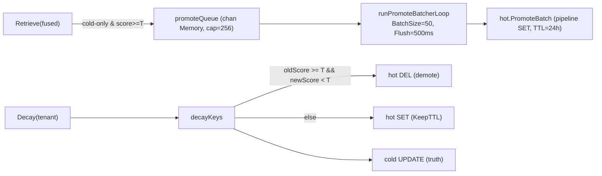
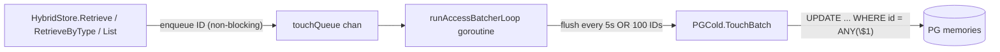
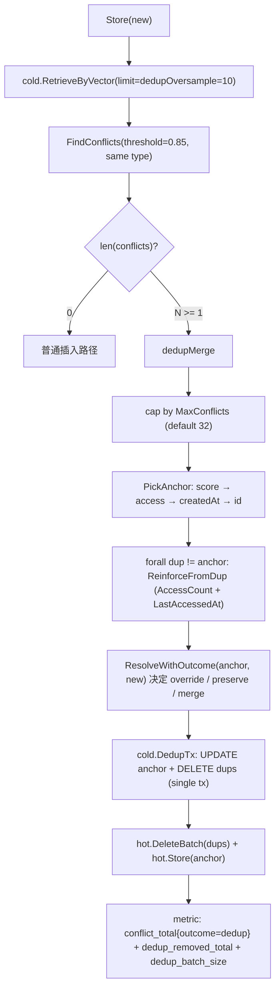
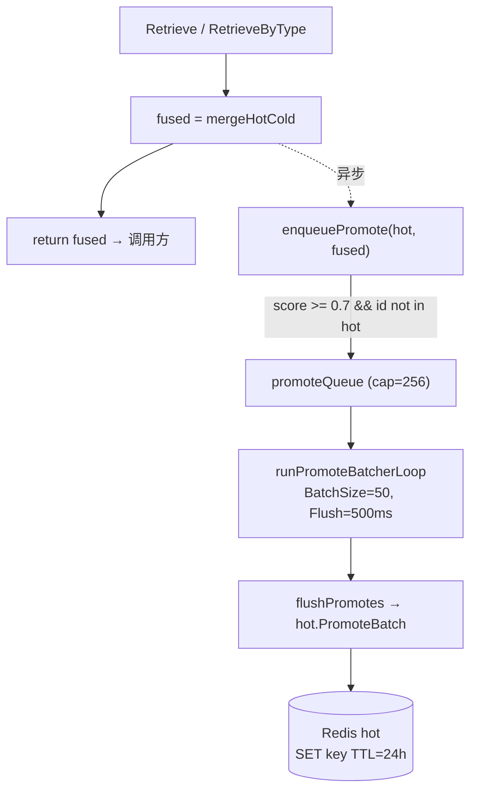
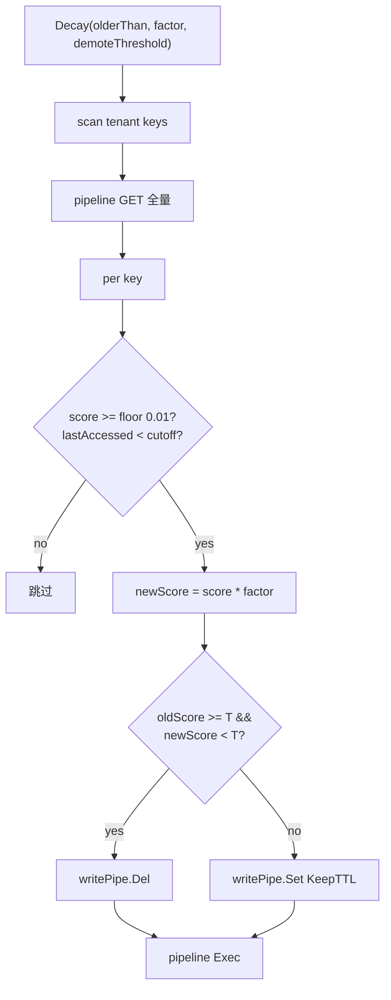
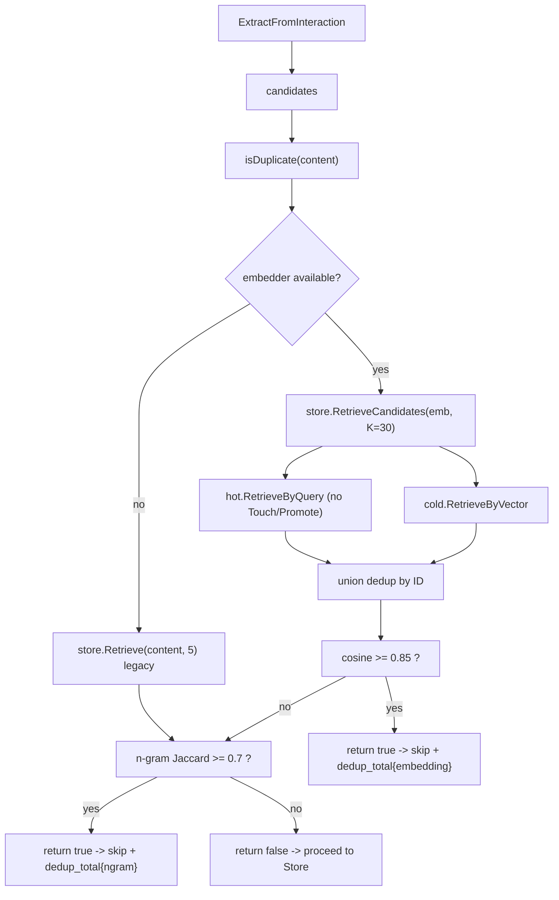

# 25 · 长期记忆系统 `internal/memory`

> 代码：
> - `types.go` (44) — `Memory` / `MemoryType` / `MemoryStore` 接口
> - `math.go` (24) — `CosineSimilarity` 向量相似度
> - `extractor.go` (345) — 从交互对话中蒸馏出"值得记住"的 Memory（LLM + 启发式双模式）
> - `hybrid.go` (152) — `HybridStore` 热/冷双层存储 + 冲突解析
> - `redis_hot.go` (159) — 24h TTL 的 Redis 热层（SCAN + 内存排序）
> - `pg_cold.go` (197) — PostgreSQL + pgvector 冷层
> - `conflict.go` (45) — `ConflictResolver` 高相似度合并
>
> 测试：`extractor_test.go` / `math_test.go` / `conflict_test.go`

---

## 1. 模块定位

**"让 agent 跨 session 记得'上周用户说过他不用 emoji'。"**

`internal/memory` 是 **长期记忆**子系统——session 结束后依然存在的、跨对话可召回的事实库。与 [21_agentloop](21_agentloop.md) 的 `TrajectoryMemory`（工具序列）、[23_toollearn](23_toollearn.md) 的 `ToolPattern`（工具反馈）是**互补**的：

| 维度 | session（02_session） | trajectory（21_agentloop）| toollearn | **memory（本模块）** |
|------|-------------|------------|-----------|---------|
| 内容 | 消息历史 | 成功工具序列 | 工具失败/耗时统计 | **结构化事实**（4 类） |
| 时效 | 30 分钟滑窗 | 50 条 FIFO | 1024 buffer + PG | **永久（带 decay）** |
| 用途 | LLM context | hint prompt | tool advice | **system prompt 注入** |
| 提取方式 | 直接 append | 任务结束时写入 | 每次工具调用 | **LLM 蒸馏 + 启发式** |

四类 Memory：

```go
MemoryPreference   "user prefers tabs not spaces"
MemoryDecision     "we picked Postgres over MongoDB for ACID"
MemoryKnowledge    "auth.go uses session-based, not JWT"
MemoryPattern      "user typically asks me to write tests after refactor"
```

每次用户对话结束，`Extractor.ExtractFromInteraction` 拿 user_msg + assistant_msg 跑一次 LLM 蒸馏，把"值得记住"的几条 Memory 存到 HybridStore。下次同一 user/project 召回时，相关 Memory 注入 system prompt。

---

## 1.5 核心设计问题

### 为什么不直接全量塞历史消息？

会话历史是**对话记录**——大部分都是过程性的（"读文件 → 改文件 → 跑测试"）。LLM 真正需要的是**结晶后的事实**：

- 不需要"用户问了三遍如何写 Go test"——需要"该用户用 testify 做断言"；
- 不需要"我读了 50 个文件"——需要"auth.go 是项目核心"；
- 不需要全量 commit log——需要"上次架构决策选了 ulid 不是 uuid"。

蒸馏 = **压缩**，几百字的对话 → 一句话事实。token 节省 50-100 倍，召回精度更高。

### 为什么 LLM 蒸馏 + 启发式双模式？

LLM 蒸馏（GPT-4o mini 跑 extractionPrompt）质量高但每次对话**多一次 API 调用 + ~1024 token**。在两种场景下切到启发式（关键词匹配）：

1. LLM 不可达（断网 / 配额耗尽 / 主备都挂）；
2. 启动 / 测试期间用户没配 LLM key。

启发式只抓固定短语（"i prefer / 我喜欢 / 从now on / 我以后…"），召回率 < 20% 但**零成本**——总比"完全没有记忆"好。

### 为什么"热/冷"两层而不是只用 Postgres？

- **热层 Redis**（24h TTL）：单次召回 < 5ms，写入 < 2ms。最近对话产生的 Memory 90% 落在这里；
- **冷层 PG + pgvector**：单次召回 ~20ms（ivfflat 索引），但**永久存储 + 向量精确搜索**。

读路径：Redis 优先；命中数足够（≥ limit）直接返回，否则**降级**到 PG。这是经典 cache-aside 模式，跟 [02_session](02_session.md) 的 hot/cold session 是同源设计。

热层用 SCAN + 内存排序而非 Redis Sorted Set——因为按 cosine 相似度排序需要逐项算（Redis 内建 ZSET 只支持单一标量打分），且热层规模小（每 user/project ≤ 50 条），内存排序代价可接受。

### 为什么要冲突合并而不是允许重复？

用户在两周内说了三次"我用 tabs"。如果每次都新建 Memory：

- 检索 top-5 时**全是同一条**——信息密度归零；
- score 分散在三个 ID 上，热度衰减算法误判；
- token 浪费。

`ConflictResolver` 用 cosine ≥ 0.85 + 同 Type 判定**语义重复**，命中后 `UPDATE` 旧条目（保留 ID 和创建时间，更新 content + score）——这让"用户重复表达偏好"被自然吸收为**强化**而非**重复**。

---

## 2. 依赖架构

```
                ┌────────────────────────────────────────────┐
                │  orchestrator.ProcessMessage 任务结束后    │
                │  ↓                                         │
                │  extractor.ExtractFromInteraction(...)     │
                │     ├─ LLM 蒸馏 → ExtractedMemory[]        │
                │     └─ 启发式 fallback                     │
                └─────────────┬──────────────────────────────┘
                              │ for each candidate:
                              ▼
                ┌────────────────────────────────────────────┐
                │  HybridStore.Store(ctx, &Memory)           │
                │    1. 调用 embedder 生成 1536d 向量         │
                │    2. ColdStore.RetrieveByVector(...)      │
                │    3. ConflictResolver.FindConflicts(≥0.85)│
                │       ├─ 有冲突 → Update 旧条目             │
                │       └─ 无冲突 → Hot.Store + Cold.Store   │
                └────────┬───────────────────────┬───────────┘
                         │                       │
                         ▼                       ▼
              ┌────────────────────┐    ┌─────────────────────────┐
              │ RedisHot           │    │ PGCold                  │
              │ key: memory:u:p:id │    │ table: memories         │
              │ TTL: 24h           │    │ pgvector: ivfflat       │
              │ SCAN 召回，内存排序│    │ 索引: user_id+project_id│
              └────────────────────┘    │       embedding<=>      │
                                        └─────────────────────────┘
                              │ 召回路径
                              ▼
                ┌────────────────────────────────────────────┐
                │  HybridStore.Retrieve(query)               │
                │  → embed(query) → 1536d                    │
                │  → Hot.RetrieveByQuery (cosine 排序)        │
                │  → 不够则 Cold.RetrieveByVector (<=> 距离)   │
                │  → 注入 system prompt: "User preferences:" │
                └────────────────────────────────────────────┘
```

---

## 2.5 数据流总览

```text
═══════════════ 写入路径（任务结束触发） ═══════════════

orchestrator.completeTask():
  go extractor.ExtractFromInteraction(ctx, userID, projID, lastUserMsg, lastAssistMsg)
    │
    ├─ if llm != nil:
    │    prompt = extractionPrompt.replace(USER_MSG, ASSIST_MSG)
    │    resp = llm.ChatCompletion(prompt, T=0.1, MaxTokens=1024)
    │    candidates = parseLLMResponse(resp.Content)   # JSON 数组
    │
    └─ else:
       candidates = extractWithHeuristics(userMsg, assistMsg)
       # 关键词匹配 prefPhrases / decisionPhrases

  for c in candidates:
    if c.Content == "" || c.Importance < 0.3: skip
    if isDuplicate(c.Content): skip  # Jaccard > 0.7 视为重复
    m = Memory{ID: uuid, UserID, ProjectID, Type, Content, Score=Importance, ...}
    store.Store(ctx, &m)


hybrid.Store(ctx, &m):
  if m.Embedding == nil:
    m.Embedding = embedder.Embed([m.Content])  # ~50ms

  if cold != nil and len(m.Embedding) > 0:
    candidates = cold.RetrieveByVector(m.Embedding, ..., 3)
    conflicts = resolver.FindConflicts(&m, candidates)  # ≥0.85 同类型
    if conflicts:
      resolved = resolver.Resolve(&conflicts[0], &m)  # 旧 ID + 新 content
      cold.Update(resolved)
      hot.Store(resolved)
      return  # 已合并

  hot.Store(&m)
  cold.Store(&m)


═══════════════ 召回路径（每次构建 prompt 触发） ═══════════════

orchestrator.buildPromptHints():
  memories = memoryStore.Retrieve(ctx, userID, projID, currentUserMsg, limit=5)
  if memories:
    hint = "[User memories]\n" + join("- " + m.Content for m in memories)
    systemPrompt += "\n\n" + hint


hybrid.Retrieve(ctx, userID, projID, query, limit):
  queryEmb = embedder.Embed(query)
  
  # 热层优先（命中率 ~70%）
  if hot != nil and queryEmb != nil:
    mems = hot.RetrieveByQuery(userID, projID, queryEmb, limit)
    if len(mems) >= limit: return mems

  # 冷层兜底
  if queryEmb != nil:
    return cold.RetrieveByVector(queryEmb, userID, projID, limit)
  return cold.Retrieve(userID, projID, query, limit)  # ILIKE 文本搜索


═══════════════ 衰减路径（定时任务） ═══════════════

每天凌晨：
  hybrid.Decay(olderThan=30*24h, factor=0.95)
    cold.Decay: UPDATE memories SET score = score * 0.95
                WHERE last_accessed_at < now()-30d AND score > 0.01
```

---

## 3. `Memory` 数据结构

```go
type Memory struct {
    ID             string     // uuid v4
    UserID         string     // 多租户隔离
    ProjectID      string     // 项目级隔离
    Type           MemoryType // preference / decision / knowledge / pattern
    Content        string     // "User prefers TypeScript with strict mode"
    Embedding      []float32  // 1536d (text-embedding-3-small)
    Score          float64    // 0-1 重要性 + decay 衰减后的当前权重
    AccessCount    int        // Touch 增加
    CreatedAt      time.Time
    LastAccessedAt time.Time
}
```

### 3.1 为什么 UserID + ProjectID 双键？

多租户场景的**最小隔离粒度**：

- 一个 user 在多个 project（每个 git repo）做事，project-A 的记忆不应该污染 project-B；
- 多个 user 在同一 project 协作，user-A 的 preference 不应该影响 user-B。

所有查询 SQL 都按 `(user_id, project_id)` 复合索引——`idx_memories_user_project`。

### 3.2 为什么 Embedding 是 1536d？

`text-embedding-3-small` 的输出维度。Schema 写死在 `CREATE TABLE memories (embedding vector(1536))`——换 embedding 模型（如 `text-embedding-3-large` 3072d）需要 schema migration。

启动时 `embedder` 是 `nil`（开发环境）也能工作——Memory 仍存到 PG（embedding 列 NULL），召回降级到 ILIKE 文本搜索（精度降但不崩）。

### 3.3 为什么 Score 是 float64 而不是 int？

Score 同时承载两个语义：

1. **初始重要性**：LLM 给 0-1 浮点（"importance": 0.9 critical, 0.5 useful, 0.3 minor）；
2. **衰减后的权重**：每次 `Decay()` 乘以 factor（如 0.95），float 才能平滑衰减；int 量化误差累积太快。

`score > 0.01` 的下限避免无限衰减——score 跌到 0.01 以下时停止 decay，保留为"几乎不用但还能召回"的状态。

---

## 4. `Extractor` —— LLM 蒸馏

### 4.1 提示词模板

```
Analyze this interaction and extract important memories worth remembering...
Focus on:
- User preferences (coding style, tools, language, workflow preferences)
- Technical decisions (architecture choices, library selections, design patterns)
- Project knowledge (file structure insights, domain-specific facts, constraints)
- Behavioral patterns (common requests, recurring problems, workflow habits)

Rules:
- Only extract genuinely useful, specific information (not generic facts)
- Each memory should be a concise, self-contained statement (1-2 sentences max)
- Score importance 0.0-1.0: 1.0 = critical preference/decision, 0.5 = useful context, 0.3 = minor detail
- If nothing worth remembering, return empty array

Respond with ONLY a JSON array:
[{"type": "preference|decision|knowledge|pattern", "content": "...", "importance": 0.0-1.0}]
```

**关键设计**：

- **空数组合法**：很多对话（"读这个文件"、"运行测试"）没什么值得记的——强制 LLM 蒸馏会产出垃圾；
- **importance 阈值 0.3**：低于这个不存——LLM 偶尔会给鸡毛蒜皮的事 0.1-0.2 重要性；
- **Temperature 0.1**：要求稳定输出，不要"创造性"；
- **MaxTokens 1024**：4-8 条 memory 已足够；多了反而稀释信号。

### 4.2 LLM 输出解析的容错

```go
// 1. 剥 markdown ``` fence
if strings.HasPrefix(content, "```"):
    content = strip first/last lines

// 2. 严格 JSON 解析
json.Unmarshal(content, &memories)
if err: return nil  // 解析失败直接放弃，不重试

// 3. Clamp importance 到 [0, 1]
for m in memories:
    if m.Content == "": skip
    if m.Importance < 0: m.Importance = 0
    if m.Importance > 1: m.Importance = 1
```

**为什么不重试？** 失败有两种：

1. LLM 输出格式错误（罕见）；
2. LLM 拒绝输出（敏感内容触发安全策略）。

两种都不适合重试——重试要么得到同样格式错误，要么继续拒绝。直接放弃，等下一次对话再试。

### 4.3 启发式 fallback

```go
prefPhrases = []{
    {"from now on", 0.9},  {"please always", 0.85},
    {"i prefer", 0.8},  {"i like", 0.6},
    {"我偏好", 0.8}, {"我喜欢", 0.6}, {"以后", 0.8},
    ...
}

decisionPhrases = []{
    {"i've decided", 0.85}, {"let's go with", 0.8},
    {"架构决策", 0.9}, {"决定使用", 0.85},
    ...
}
```

匹配后用 `extractSentence(text, phrase)` 抠出"包含该短语的整句"作为 Memory 内容。中英文混编是有意的——本项目用户群覆盖。

**召回率约束**：启发式只能抓**显式声明**的 preference/decision；隐式偏好（"我每次都让你用 type annotation"）抓不到。这是 LLM 模式的存在意义。

### 4.4 去重

```go
func isDuplicate(ctx, userID, projectID, content):
    if embedder is wired:
        newVec = embedder.Embed(content)
        existing = store.RetrieveCandidates(ctx, userID, projectID, newVec, K)  // P1 #9: K=30
    else:
        existing = store.Retrieve(ctx, userID, projectID, content, 5)  // legacy fallback
    for m in existing:
        if cosine(newVec, m.Embedding) >= 0.85: return true   // Path A
        if ngramJaccard(content, m.Content)   >= 0.7:  return true  // Path B
    return false
```

**Path 选择**：

- **Path A — 向量近邻 (embedder 可用时)**：用 `RetrieveCandidates` 拉 K=30 条候选（不走 RRF / 不触发 Touch / 不触发 Promote），cosine ≥ 0.85 即判定重复。这是 P1 #9 的核心修复——旧版只拉 top-5 导致大库 rank-6..30 的真重复漏过。
- **Path B — n-gram Jaccard (lexical fallback)**：兼容 embedder 不可用的部署形态；走老的 `Retrieve(content, 5)` 路径，K 偏小但 lexical 信号本就有限，影响不大。

**两类查询分离**：

| 语义 | 路径 | K | 副作用 |
|------|------|---|--------|
| 用户检索 | `HybridStore.Retrieve` (RRF 融合) | 5–20 | `enqueueTouches` + `enqueuePromote` |
| Dedup 预筛 (P1 #9) | `HybridStore.RetrieveCandidates` (并集去重) | 30 (clamp 5..200) | 零 |

**配置**：`memory.dedup_candidate_limit`，默认 30。配套指标 `memory_dedup_candidate_count`：P95 ≈ limit 时表示库已大到需要再调。

**与 P1 #7 的关系**：本节是**写入前**预筛，把多数重复挡在 Store 之外；P1 #7 是**写入后**的 anchor+drain 兜底，处理预筛漏掉以及历史已积压的重复。两者上下游互补，不重叠。

---

## 5. `HybridStore` —— 热/冷双层

### 5.1 写路径决策树

```
Store(m):
  ① 无 embedding 时调 embedder 生成 (cost ~50ms / API call)
  ② cold 可用 + embedding 有 → 查冷层 top-3 候选
     ③ ConflictResolver.FindConflicts (cosine ≥ 0.85 + same type)
        ④ 有冲突 → Resolve（旧 ID 接管新 content）→ cold.Update + hot.Store
        ⑤ 无冲突 → hot.Store + cold.Store
  ⑥ embedder 不可用 → 跳过冲突检查，直接 hot.Store + cold.Store
```

Hot 写失败只记 Debug 日志（**不阻塞**）——hot 是缓存，丢一条无所谓；Cold 写失败直接 return err（持久层必须可靠）。

### 5.2 读路径决策树

```
Retrieve(query, limit):
  queryEmb = embedder.Embed(query)
  
  if hot && queryEmb:
    mems = hot.RetrieveByQuery (cosine 内存排序)
    if len(mems) >= limit: return mems   # 热层命中足够直接返回
  
  if hot && !queryEmb:
    mems = hot.Retrieve (按 key 字典序最近)
    if len(mems) >= limit: return mems   # 无 query embedding 的降级
  
  if cold && queryEmb:
    return cold.RetrieveByVector (pgvector <=> cosine 距离)
  
  return cold.Retrieve(query)            # ILIKE 文本搜索（最弱）
```

**关键**：热层只在"命中数 ≥ limit"时直接返回——少于 limit 时穿透到冷层。这是因为热层只缓存了 24h 内的，老 Memory 必须从冷层捞。

### 5.3 Promote / Demote

两层缓存的实际意义在于"热度自动迁移"：

- **Promote（cold → hot，读路径自动）**：`Retrieve` / `RetrieveByType` 把 fused 结果里"cold 命中但 hot 没有 且 `Score >= Threshold`"的条目入异步队列；后台 `runPromoteBatcherLoop` 攒批后调用 `hot.PromoteBatch` 单 pipeline SET，使下次召回走 5ms 热路径。
- **Demote（hot → 蒸发，Decay 路径触发）**：`Decay` 在做 `score *= factor` 时如果"本次跨过 `DemoteThreshold`"，把 hot 副本 `DEL`（cold 仍保留为 truth）；这样 hot 不再被低信号条目挤占。



**关键设计决策**：

| 决策 | 理由 |
|------|------|
| Promote 走异步批次，不阻塞 Retrieve | 读路径延迟 SLO 高于"命中精度"；丢一次 promote 下次 Retrieve 还会再触发 |
| 只 promote `Score >= Threshold` 的条目 | hot 24h 占用是稀缺资源，不能被 0.4 分的 noise 撑爆 |
| Demote 只在跨阈值的瞬间触发（不在已低于阈值的条目反复 DEL） | 避免 Decay 每个 tick 都 DEL 同一批 key，metric 也更干净 |
| Demote 不动 cold | cold 是 truth；下次 Score 涨回阈值之上由 Promote 重新拉热 |
| Promote 失败不重试 | 自然收敛：下次 Retrieve 仍会发现 cold-only 命中并重排队 |

**禁用方式**：`Promote.Enabled=false` 关闭 cold→hot 回填；`Demote.Enabled=false` 或 `Demote.Threshold=0` 关闭 hot 蒸发（Decay 仍正常工作）。

**指标**：

- `memory_promote_total{status}` —— promote 批次成功 / 失败计数
- `memory_promote_batch_size` —— 每次 flush 的批量
- `memory_promote_queue_drops_total` —— 队列溢出丢弃数（若长期 > 0 说明 QueueSize 偏小）
- `memory_demote_total{tier="hot"}` —— hot 蒸发计数

---

## 6. `RedisHot` —— 24h TTL 热层

### 6.1 Key 设计

```
memory:{userID}:{projectID}:{memoryID}   = JSON(Memory)  TTL=24h
```

`SCAN pattern="memory:{u}:{p}:*"` 拿到所有该 user/project 的 Memory keys。**为什么不用 SET / HASH 维护索引？**

- SET 索引要双写（每次 Store 同时 SADD + SET 单条），多一次往返；
- TTL 由 Redis 单 key 控制；用 SET 索引时需要手动剔除已 TTL 失效的成员；
- 当前规模（每 user/project ≤ 50 条）SCAN 完全够用，加索引复杂度收益太低。

### 6.2 为什么用 SCAN 而不是 KEYS？

`KEYS pattern` 在大型 Redis 实例上 O(N) 阻塞所有命令；SCAN 是渐进式扫描，cursor 分批拿。这是 `redis-cli` 文档反复警告的"不要在生产用 KEYS"——本项目从一开始就走 SCAN。

**SCAN 预算（P1 #10）**：`RedisHot.scanAll` 是所有读路径（`Retrieve` / `RetrieveByQuery` / `Decay` / `decayTenant`）共享的扫描内核。预算计算分两层：

1. **实例级 `scanLimit`**：构造时由 `defaultHotScanLimit = 200` 初始化；可通过 `SetScanLimit(n)` 改成 [50, 2000] 的任意值（`memory.hot_scan_limit` 配置项）。**这是稳态扫描预算**。
2. **调用方 `requested`**：`Retrieve` / `RetrieveByQuery` 传入 `limit * 2`；`Decay` 路径传 0。`scanAll` 计算 `effectiveCap = max(scanLimit, requested)`，再 clamp 到 `maxHotScanLimit = 2000` 上限。

**截断观测**：扫到 `effectiveCap` 就 break 出 iterator，并触发 `memory_hot_scan_truncated_total{endpoint}` 计数。endpoint 标签 = `retrieve` / `retrieve_by_query` / `decay` / `decay_tenant`，与 `memory_hot_scan_keys` 对齐。**这是 P1 #10 修复的核心信号**——之前 caller `limit > scanCap` 时静默丢 key，没有任何观测面能让运维察觉。

**调参姿势**：
- `rate(memory_hot_scan_truncated_total[5m]) > 0` 持续 → 调大 `memory.hot_scan_limit`（默认 200，可上调到 2000）
- `histogram_quantile(0.95, memory_hot_scan_keys_bucket)` 接近 `hot_scan_limit` → 离截断不远，预警阈值

### 6.3 RetrieveByQuery 的内存排序

```go
// 拿到所有 hot key
keys = SCAN(pattern, max=50)
// pipeline GET
items = pipe.Get(keys...)
// 内存计算 cosine
for each item:
    sim = CosineSimilarity(queryEmb, item.Embedding)
    results.append({memory, sim})
sort by sim desc
return top-limit
```

热层规模 ≤ 50 条 × 1536 dim × 4 bytes ≈ 300KB——内存里跑 50 次 cosine 计算大约 200μs。**不需要 Redis Stack / RediSearch 的向量索引**——那是为 100K+ 规模设计的，本场景过度工程。

### 6.4 数据丢失语义

- TTL 24h 到期 Redis 自动删除——冷层 PG 仍有；下次召回穿透到冷层依然能拿到。
- Redis 重启 / FLUSHDB → 热层全空，召回降级到冷层，性能下降但**不影响功能**。

**为什么 TTL 而不是手动管理 LRU？** Redis 内建 TTL 是免费的——不需要写额外的回收 goroutine。代价是 24h 是**绝对时间**而非"最近访问"——这是为了让热层规模可预测（每 user/project × 24h ≤ 几十条）。

---

## 7. `PGCold` —— 永久存储 + 向量搜索

### 7.1 Schema

```sql
CREATE EXTENSION IF NOT EXISTS vector;

CREATE TABLE memories (
    id UUID PRIMARY KEY,
    user_id TEXT NOT NULL,
    project_id TEXT NOT NULL,
    type TEXT NOT NULL,
    content TEXT NOT NULL,
    embedding vector(1536),
    score FLOAT DEFAULT 1.0,
    access_count INT DEFAULT 0,
    created_at TIMESTAMPTZ DEFAULT NOW(),
    last_accessed_at TIMESTAMPTZ DEFAULT NOW()
);

CREATE INDEX idx_memories_user_project ON memories(user_id, project_id);
CREATE INDEX idx_memories_type ON memories(type);
CREATE INDEX idx_memories_score ON memories(score DESC);
CREATE INDEX idx_memories_embedding ON memories
    USING ivfflat (embedding vector_cosine_ops) WITH (lists = 100);
```

**索引选择**：

- `idx_memories_user_project` —— 几乎所有查询都过滤这两列，复合索引必备；
- `idx_memories_type` —— 按类型筛选（"只看 preference"）；
- `idx_memories_score DESC` —— 排序辅助；
- `idx_memories_embedding ivfflat lists=100` —— pgvector 的近似最近邻索引。

### 7.2 为什么 ivfflat 不是 hnsw？

`pgvector` 提供两种向量索引：

| 索引 | 召回率 | 写延迟 | 内存占用 | 适用规模 |
|------|--------|--------|----------|----------|
| ivfflat | ~95% | 低 | 低（基于聚类）| < 10M 行 |
| hnsw | ~99% | 高 | 高（每行 ~100B 额外）| > 1M 行 |

Memory 表预期规模：每 user 每 project 几百条；1000 user × 10 project × 500 = 5M 行。完全在 ivfflat 舒适区。`lists=100` 是经验值（约 √行数 / 10）——pgvector 文档推荐。

### 7.3 cosine 距离查询

```sql
SELECT ... FROM memories
WHERE user_id = $1 AND project_id = $2 AND embedding IS NOT NULL
ORDER BY embedding <=> $3
LIMIT $4
```

`<=>` 是 pgvector 的 cosine 距离运算符（1 - cosine_similarity）。`ORDER BY <=>` 才能使用 ivfflat 索引（其他距离运算符 `<#>` `<-> ` 需要不同的索引类型）。

### 7.4 `formatVector` / `parseVector` —— 文本协议

```go
// Go float32 → pgvector text: [0.1,0.2,0.3]
func formatVector(v []float32) string {
    b.WriteByte('[')
    for i, f := range v {
        if i > 0 { b.WriteByte(',') }
        fmt.Fprintf(&b, "%g", f)
    }
    b.WriteByte(']')
}
```

pgvector 通过 PostgreSQL 的 `text` 类型协议传输向量——driver/sql 不需要知道 vector 类型，把它当字符串发就行。`%g` 用最短的浮点表示（自动选择 e 或 f 格式）——比 `%f` 紧凑 30%+。

### 7.5 衰减算法

```sql
UPDATE memories SET score = score * 0.95
WHERE last_accessed_at < $cutoff AND score > 0.01
```

- 只衰减"久未访问"的（30 天前的）；
- 下限 0.01——防止无限趋近 0；
- 操作幂等，每天跑一次：score 走 0.95^N 几何衰减；
- 召回时按 score DESC 排序——衰减直接影响排序权重。

`Touch(id)` 在召回时调用：`access_count += 1`、`last_accessed_at = NOW()`——重新激活"最近被用过"的 Memory，下次 Decay 跑不到它。

---

## 8. `ConflictResolver` —— 高相似度合并

### 8.1 检测

```go
func FindConflicts(newMem, candidates):
    for c in candidates:
        if c.Embedding == nil || c.Type != newMem.Type: skip
        sim = CosineSimilarity(newMem.Embedding, c.Embedding)
        if sim >= 0.85: conflicts.append(c)
```

**两个约束**：

1. **同 Type 才算冲突** —— preference 不应该被 knowledge 覆盖；
2. **0.85 阈值** —— 0.95 太严（漏报多）、0.75 太宽（误合并不同概念）。0.85 是经验值。

### 8.2 解析

```go
func Resolve(old, new) *Memory:
    old.Content = new.Content
    old.Embedding = new.Embedding
    old.Score = new.Score
    return old
```

**就地更新**——保留 `old.ID` / `old.CreatedAt` / `old.AccessCount`。这样：

- 历史上的引用（如审计日志记录的 memory ID）依然有效；
- 创建时间不会"被刷新"——便于按真实创建时间排序（"这个 preference 是用户多久前说的"）；
- access_count 累加——"用户重复表达"被视为"经常访问"，提升权重。

`Score` 用新值（不取 max）—— 因为新值通常是 LLM 蒸馏出的最新 importance，反映"用户当前对这件事的重视程度"。

---

## 9. 启动接入

```go
// cmd/agent/main.go:423
memAdapter := NewMemoryAdapter(rdb, pgStore, embedder, logger)
if memAdapter != nil {
    orch.SetMemoryStore(memAdapter)
}
if memAdapter != nil {
    memoryExtractor := memory.NewExtractor(memAdapter.HybridStore(), llmClient, logger)
    orch.SetMemoryExtractor(memoryExtractor)
}
```

`NewMemoryAdapter` 在 `cmd/agent/memory_adapter.go` 里——它把 `RedisHot` + `PGCold` 包装成符合 `orchestrator.MemoryStore` 接口的 adapter。所有持久化都是 **optional**：

- `rdb == nil` → 只有冷层
- `pgStore == nil` → 只有热层（24h 后全丢，仅适合 demo）
- 都没有 → `NewMemoryAdapter` 返回 nil → orchestrator 跳过整套 memory 逻辑

启动时 `PGCold.Migrate()` 自动建表 / 索引——idempotent（`IF NOT EXISTS`）。

---

## 10. 与其他模块的边界

### 10.1 上游：orchestrator

```go
type Orchestrator struct {
    memoryStore     memory.MemoryStore        // HybridStore 实现
    memoryExtractor *memory.Extractor          
}

// 任务结束时蒸馏
defer func() {
    go o.memoryExtractor.ExtractFromInteraction(ctx, userID, projID, userMsg, asstMsg)
}()

// 构建 prompt 时召回
mems := o.memoryStore.Retrieve(ctx, userID, projID, currentMsg, 5)
systemPrompt += formatMemories(mems)
```

蒸馏是 **fire-and-forget goroutine**——不阻塞用户响应（蒸馏失败也不影响主流程）。

### 10.2 下游：embedder

`HybridStore.embedder` 接口是 `func Embed(ctx, []string) ([][]float32, error)`——与 `internal/rag` 的 embedder **共享同一实例**（main.go 注入同一个 `rag.Embedder`）。这样：

- 缓存（如果 embedder 内部带）共享；
- 配额走同一个计数器；
- 升级 embedding 模型一处生效。

### 10.3 平行：session manager

session 是**消息历史**，memory 是**结晶事实**。两者**没有数据流连接**——session 由 orchestrator 直接管理（写入 / 召回 / 裁剪），memory 由 extractor 单独从对话中蒸馏。**故意解耦**：session 是工作记忆，memory 是知识库。

---

## 11. 设计权衡

| 抉择 | 动机 |
|------|------|
| LLM 蒸馏 + 启发式双模式 | LLM 精度高但可能不可用；启发式作为永远在线的底线 |
| 4 类 MemoryType 硬编码 | 软分类（embedding）成本高；preference/decision/knowledge/pattern 覆盖 95% 场景 |
| 热/冷分层 + Redis SCAN | 与 session 同源；热层规模小到无需向量索引 |
| Cosine ≥ 0.85 合并 | 经验阈值；同类型 + 高相似 = 重复表达 |
| 就地 Update 而非新建 | 保留 ID + CreatedAt + AccessCount，"重复表达" → "强化" |
| Score float64 + decay | int 衰减误差累积；0.95 几何衰减平滑 |
| Embedder 可空 → 文本搜索降级 | 开发 / 测试环境不强制配 embedding；功能不崩 |
| importance < 0.3 不存 | LLM 偶尔产 0.1-0.2 的鸡毛蒜皮；阈值过滤 |
| Extractor goroutine fire-and-forget | 蒸馏耗时 (~LLM 调用 + embedding) 不阻塞用户响应 |
| 1536d hard-coded schema | text-embedding-3-small 的维度；换模型需 migration |
| `idx_memories_score DESC` 单列索引 | 实际查询多按 user_id+project_id 先过滤再排序；单列索引覆盖率有限——可考虑去掉 |

---

## 12. 后续演进

- [ ] **多 embedding 模型支持**：用 `embedding_model` 列区分不同维度的向量，schema 改 `vector(NULL)` 动态长度
- [ ] **跨 project 共享 preference**：当前严格按 user_id+project_id 隔离；"我永远不用 emoji" 这种应该跨 project 共享
- [ ] **召回时自动 Promote**：cold 命中且 score > 0.7 时自动写入 hot，下次 5ms 响应
- [ ] **LLM 召回排序**：当前 cosine 排序，召回 top-10 后让 LLM rerank 选出 top-5——质量提升但成本翻倍
- [ ] **Negative memory**：当前只学正向（用户喜欢 X）；"用户**反对**用 Y"同样有价值
- [ ] **审计**：每次 Memory 注入 prompt 时记 audit log，便于解释"为什么 agent 突然知道我的偏好"
- [ ] **数据导出**：用户能查看/删除自己的 Memory（GDPR 合规）
- [ ] **重要性自适应**：access_count 高的 Memory 自动提升 score（"反复用上的偏好"权重高）
- [ ] **冲突解析策略可配置**：当前默认"覆盖式"；可加"merge mode"——把旧 content 和新 content 拼起来
- [ ] **Hot 层主动失效**：用户改 preference 后老 Memory 应主动 Demote（当前依赖 24h TTL 自然过期）

---

## 13. 与人类记忆的类比

`internal/memory` 的设计粗略对应**陈述性记忆**（declarative memory）：

| 人脑 | 本模块 |
|------|--------|
| 短期记忆（working memory） | session 消息历史 |
| 海马体 → 皮层 巩固 | extractor 蒸馏对话 → 写入 store |
| 长期记忆（事实+事件） | Memory{Type, Content} |
| 检索激活 | cosine 召回 + LLM rerank |
| 遗忘曲线 | Decay() 几何衰减 |
| 重复 = 强化 | ConflictResolver 就地 Update + AccessCount |

agent 没有海马体——extractor 替代它做"哪些值得记 / 怎么压缩"的判断。`Decay` 实现"用进废退"，与艾宾浩斯曲线异曲同工。

---

## 14. 修复时间线

### 2026-06-26 P0/P1/P2 14 项缺陷一次性闭环

> 触发：用户面试题语境下对本模块做了一次系统性复审，发现并修复 14 处缺陷。所有改动通过 `internal/memory` + `internal/api` + `internal/orchestrator` + `internal/models` + `internal/tools` 包单测（零回归）。详见 `llmdoc/memory/doc-gaps.md::§2026-06-26`。

**P0（正确性 / 隐私）**

| ID | file:line | 修复 |
|---|---|---|
| MEM-P0-1 | `internal/tools/memory_tools.go::resolveMemoryIdentity` | CoreMemoryTool 不再硬编码 `default_user`/`default_project`；通过 `models.UserIDFromContext` 取真实 user/project |
| MEM-P0-2 | `internal/orchestrator/memory_bridge.go::formatCoreMemory` | CoreMemory 现在被注入 prompt 的 `[Core Memory]` 块（之前是「只写黑洞」）；`cmd/agent/main.go:545` 接线 |
| MEM-P0-3 | `internal/memory/hybrid.go::Store` | 双写改为 cold-first；hot 失败 Warn 不阻塞；合并分支也走 `publishEvent` |
| MEM-P0-4 | `internal/memory/pg_cold.go::Migrate` | 加 `updated_at` 列 + `NewPGColdWithDim(dim)` 显式校验维度 |

**P1（重要功能缺陷）**

| ID | file:line | 修复 |
|---|---|---|
| MEM-P1-1 | `internal/memory/conflict.go::ResolveWithOutcome` | score-aware 三分支 + AccessCount 累加；`ConflictResolverConfig` 阈值/margin 可配置 |
| MEM-P1-2 | `internal/memory/extractor.go::extractWithLLM` | system+user 双消息 + `<<<INTERACTION_BEGIN/END>>>` 哨兵防 Prompt Injection；`maxPerRun` 硬截断 |
| MEM-P1-3 | `internal/memory/extractor.go::piiMasker` | LLM 调用前 + 入库前双重 PII 遮蔽（AWS_KEY / sk- / JWT / Bearer / 高熵 token / 私钥块 / 邮箱 / IPv4） |
| MEM-P1-4 | `internal/memory/extractor.go::isDuplicate` | 去重三路：embedding 余弦 → word Jaccard → 字符 3-gram Jaccard 取 max（修复中文场景） |
| MEM-P1-5 | `internal/memory/hybrid.go::Retrieve` + `fuseRRF` | hot+cold 并行 + RRF 融合（k=60）；hot 加 tie-breaking bonus |
| MEM-P1-6 | `internal/orchestrator/memory_bridge.go::extractMemoriesAsync` | `detachCancel` 自定义 ctx 保留 Values 但忽略 Cancel/Deadline；ReAct 入口统一注入 (sessionID, userID, projectID) |

**P2（工程化 / 治理）**

| ID | 落地 |
|---|---|
| MEM-P2-1 | `cmd/agent/memory_adapter.go::runMemoryDecayLoop` 周期 ticker + shutdown 优雅退出 |
| MEM-P2-2 | `internal/metrics/memory.go` 新增 10 个 metrics（store/retrieve/conflict/dedup/decay/extractor/blackboard） |
| MEM-P2-3 | `config.MemoryConfig` 全字段可在 `config.yaml` 调；零字段走代码默认值 |
| MEM-P2-4 | Blackboard `Publish` 埋出口 metric + `Subscribe` drop 分支 `MemoryBlackboardDroppedTotal` 计数（不再静默丢） |

**横切：跨包 context 契约**

新文件 `internal/models/context.go` 定义 `WithSessionContext` / `*FromContext` helper。所有下游包应优先用这套 helper 而非自定义 contextKey；orchestrator 内的旧 `ctxKeySessionID` 暂保留兼容。

**已知残余 TODO**（见 `llmdoc/memory/doc-gaps.md::§E`）：

- Trajectory Memory 持久化（PG + intent embedding） — 当前 `internal/agentloop/trajectory_memory.go` 仍是进程内 50 条 FIFO。
- `memory.Distiller` 接线 — 蓝图里的「episodic → semantic 周期蒸馏」生产代码不跑。
- CoreMemory 跨 project 共享 preference。
- 召回时按 importance 分桶（保证至少 1 条 preference + 1 条 decision）。

---

## 15. 修复时间线 — 2026-06-26 二轮闭环（T1–T5）

紧接 §14 的 14 项 P0/P1/P2 之后，又把 §14 列出的「已知残余 TODO」+ 一项私有 contextKey 清理一次性落地，共 5 个 T 任务，11 个落地点。

| ID | 痛点 | 关键落地 |
|---|---|---|
| **T1** | Trajectory 进程内 50 条 FIFO，重启丢全部 + 字符串等值召回不智能 | `agentloop.TrajectoryStore` 接口拆出；`PGTrajectoryStore` 落 PG + ivfflat KNN；`Retrieve` 先 KNN 再 string-equality fallback；`cmd/agent` 接线 embedder 可选 |
| **T2** | `memory.Distiller` 只看 hot 50 条 + 没 ticker | 重写走 `DistillerStore` 接口（HybridStore.ListByType 实现）；`MemoryDistillConfig` + `runMemoryDistillLoop` ticker + shutdown 优雅退出；3 个新 metrics（`distill_runs_total` / `distill_duration_seconds` / `distill_produced_total`） |
| **T3** | CoreMemory 只能按 project 隔离，user 级 persona 在新 project 里直接消失 | `CoreMemoryScope` 枚举（project/user）+ `GetCoreMemoryScoped` / `AppendToSectionScoped` / `ReplaceInSectionScoped` + **`GetMerged`**（project 覆盖 user）；旧不带 scope 的接口保留向后兼容并默认走 project；`core_memory_append/replace` tools 新增 `scope` 可选参数，提示词渲染时给 user-scope 节追加 `(user)` 标签 |
| **T4** | `MemoryRetriever.Retrieve` 一刀切 top-K，可能 5 条全是 `knowledge`，把 `preference` 挤掉 | `RetrieveByType` 加到 interface（HybridStore + memoryAdapter 实现，cold 走 SQL `WHERE type=$5`，hot 走 over-fetch 客户端过滤）；`buildLongTermMemory` 改 importance 分桶：先保 1 条 `preference` + 1 条 `decision`，剩余位用通用 top-K，按 content 去重 |
| **T5** | `orchestrator.ctxKeySessionID` 私有 contextKey 在 file_tools / orchestrator / react_core 各处自取自用 | 全部迁移到 `models.SessionIDFromContext`；私有 `contextKey` 删除；context 设置路径统一走 `models.WithSessionContext`（一行设三键） |

新增 / 改动文件：

- 新增 `internal/agentloop/pg_trajectory_store.go`（含 `IntentEmbedder` 接口、ivfflat schema、KNN+fallback）
- 改造 `internal/agentloop/trajectory_memory.go`（接口化 + 保留 `FormatHint` 旧 API）
- 改造 `internal/memory/distiller.go`（接口化 store；`DistillerOptions` 三阈值）
- 改造 `internal/memory/core_memory.go`（双 keyspace + 旧 key alias 读 + 默认 sections only-for-project）
- 改造 `internal/memory/types.go`（`CoreMemoryScope` + 扩展 `CoreMemoryManager` 接口）
- 改造 `internal/memory/hybrid.go`（`RetrieveByType` + `ListByType` + `filterByType` helper）
- 改造 `internal/memory/pg_cold.go`（`RetrieveByVectorAndType` 双分支 SQL）
- 改造 `internal/orchestrator/{orchestrator,react_core,file_tools,memory_bridge}.go`（contextKey 迁移 + `SetTrajectoryStore` + `retrieveBucketedMemories` + `GetMerged` 拼接）
- 改造 `internal/tools/memory_tools.go`（scope 参数 + parseScope helper）
- 改造 `internal/config/config.go`（`MemoryDistillConfig` + `MemoryDistillTarget`）
- 改造 `internal/metrics/memory.go`（distill 三个新 metric）
- 改造 `cmd/agent/{main,memory_adapter}.go`（接线 PGTrajectoryStore + distillerLLMAdapter + runMemoryDistillLoop + shutdown chain）

设计点 / 取舍：

1. **接口而非类型**：`DistillerStore` / `TrajectoryStore` / `IntentEmbedder` 都是本地最小接口，避免循环导入也方便测试 fake；同时让旧的 `RedisHot`-only 调用模式仍可通过升级测试继续覆盖核心逻辑。
2. **PG schema 都走 `IF NOT EXISTS`**：trajectory_embedding 列、idx_trajectories_intent_embedding 均幂等，老部署不破坏。
3. **KNN 失败回退到字符串相等而非空结果**：早期空表 / embedder 临时挂掉时不让 hint 完全消失；只在 KNN 返回 > 0 才覆盖 fallback。
4. **CoreMemory legacy key 仅在 project scope 读时尝试**：写永远走新 keyspace；避免老 key 不可见也避免写脏新 key。
5. **distill ticker 默认禁用 + 5min 延迟启动**：避免空配置的部署被自动消耗 LLM 配额；和 decay ticker 同样 staggered start 防止 t=0 stampede。
6. **buckets dedup 按 content 不按 id**：MemoryEntry 在 orchestrator 层没暴露 id，content 是稳定可比的最小字段。
7. **scope 默认 project**：未指定 scope 时不会意外写到 user 全局，防止"工程师以为只动这个 repo 实际改了所有 repo"。

验证：

- `go build ./...` ✅
- `go test ./internal/memory/... ./internal/agentloop/... ./internal/tools/... ./internal/orchestrator/...` ✅
- `go test ./tests/internal/memory/...` ✅
- `ReadLints` 全部受影响文件 ✅

---

## 16. 修复时间线 — 2026-06-26 三轮闭环 P0 #1：Distiller 空转

### 16.1 病征

之前两轮（§14/§15）虽然把 Distiller 接线进了 `runMemoryDistillLoop` ticker，但忽略了一个事实：**全仓零代码写入 `MemoryTypeEpisodic`**。`Extractor.parseMemoryType` 只接受 `preference/decision/knowledge/pattern` 四类，`ExtractFromInteraction` 不可能产出 episodic；Distiller `ListByType(episodic)` 因此永远返回空，蒸馏 ticker 每轮都是 no-op，只产生 `distill_runs_total{path="skipped"}` 指标——蓝图设计的 "hippocampus → cortex 巩固" 在生产里**完全不运行**。

### 16.2 修复策略

| 维度 | 决策 |
|---|---|
| 写入来源 | task 完成时写 1 条 episodic = 任务原始流水（user_msg + final_assistant_msg + 工具序列），**不调 LLM**（成本翻倍） |
| 召回隔离 | episodic **不进**默认 prompt 召回路径（PGCold.Retrieve / RetrieveByVector / RedisHot.RetrieveByQuery / Retrieve 全部加 `type <> 'episodic'`） |
| 去重 | 新增 `Memory.DistilledAt *time.Time`；Distiller 成功后批量 `UPDATE ... SET distilled_at = NOW() WHERE id = ANY(...)` |
| 重复消费防御 | `PGCold.ListEpisodicUndistilled` 走带 `distilled_at IS NULL` 的专用 SQL + 部分索引 `idx_memories_episodic_undistilled` |

### 16.3 数据流（落地版）

```text
task complete
  ├─ extractMemoriesAsync         → typed memory (preference/decision/...)
  └─ recordTaskEpisodeAsync (NEW) → episodic (raw timeline)

distill ticker (default 6h)
  ├─ HybridStore.ListByType(episodic)
  │    └─ PGCold.ListEpisodicUndistilled
  │         WHERE type='episodic' AND distilled_at IS NULL
  │         ORDER BY created_at ASC
  ├─ LLM consolidate → 1 semantic memory
  ├─ HybridStore.Store(semantic) → cold + hot
  └─ HybridStore.MarkDistilled(ids)
       └─ PGCold.MarkDistilled
            UPDATE memories SET distilled_at = NOW()
            WHERE id = ANY($1) AND distilled_at IS NULL

prompt build
  └─ buildLongTermMemory.retrieveBucketedMemories
       ↓ no episodic ever surfaces here (filtered at PG/Redis layer)
```

### 16.4 关键接口变更

| 位置 | 变更 |
|---|---|
| `internal/memory/types.go::Memory` | 加 `DistilledAt *time.Time` |
| `internal/memory/pg_cold.go::Migrate` | 加 `ALTER TABLE ... ADD COLUMN IF NOT EXISTS distilled_at` + 部分索引 |
| `internal/memory/pg_cold.go::Store` | INSERT 12 列；ON CONFLICT 不动 `distilled_at`（避免 re-Store 反标） |
| `internal/memory/pg_cold.go` | 新增 `ListEpisodicUndistilled(ctx, ...)` + `MarkDistilled(ctx, ids)` |
| `internal/memory/pg_cold.go::Retrieve / retrieveByVectorTyped` | 默认 `AND type <> 'episodic'` |
| `internal/memory/redis_hot.go::RetrieveByQuery / Retrieve` | 客户端过滤 `m.Type != MemoryTypeEpisodic` |
| `internal/memory/hybrid.go::ListByType` | episodic 路径走 cold 专用 SQL；新增 `MarkDistilled` 转发 |
| `internal/memory/distiller.go` | `DistillerStore` 接口加 `MarkDistilled`；`Distill` 成功后调用，metric `distill_produced_total{kind="marked"}` |
| `internal/memory/extractor.go` | 新增 `RecordTaskEpisode(ctx, ...)`：拼装 USER/ASSISTANT/TOOLS 三段，走 PII masking，**跳过** importance 阈值 |
| `internal/orchestrator/react_core.go::reactCoreResult` | 加 `toolsUsed []string`；7 处 return 都附带 |
| `internal/orchestrator/orchestrator.go::reactLoop` | 返回签名改为 `(string, []string, error)`；3 处调用点更新 |
| `internal/orchestrator/memory_bridge.go` | 新增 `recordTaskEpisodeAsync`，与 `extractMemoriesAsync` 并排独立调用 |

### 16.5 设计取舍

1. **不调 LLM 写 episodic**：避免 task 完成时 LLM 成本翻倍。Distiller 阶段才调 LLM 做语义压缩——这样 50 条 episode 才花一次 LLM 调用。
2. **episodic 跳过 importance 阈值**：全部入库才能给 Distiller 完整画像；用 `DistilledAt` + decay 管控数量。
3. **永久标记 `DistilledAt`**：避免同一段历史被反复消费产生重复 semantic。
4. **不删 episodic**：保留作为审计追溯（"为什么 agent 产出了这条 semantic 规则"），由 decay 自然衰减 score 即可。
5. **ON CONFLICT 不动 distilled_at**：如果未来某条 episodic 被 re-Store（比如 ConflictResolver 路径），不能 silently 抹掉它的蒸馏标记——否则下次 ticker 会重复消费。
6. **`scope` 默认 project**（继承前轮决策）：episodic 不跨 project 共享，每个 (user, project) 独立蒸馏。
7. **测试用 fake 而非 testcontainer**：`fakeDistillerStore` 模拟 `ListEpisodicUndistilled` 的过滤语义；这样 unit test 不需要 PG，但等价测了"蒸馏后跳过"的关键不变量。

### 16.6 验证

- `go build ./...` ✅
- `go test ./internal/memory/... ./internal/orchestrator/... ./internal/agentloop/... ./internal/tools/... ./tests/internal/memory/...` ✅（11 条测试全 PASS，包括 4 条新增 episodic + distill mark）
- `ReadLints` 11 个改动文件 ✅

---

## 17. 修复时间线 — 2026-06-26 三轮闭环 P0 #2：hot retrieve 真实时间排序

### 17.1 病征

`RedisHot.Retrieve` 旧实现做了 `sort.Strings(keys)`，假设 key 里有时间前缀；但 key 是 `memory:<userID>:<projectID>:<uuid_v4>`，UUIDv4 完全随机。结果："take most recent N" 的语义在生产里**等价于 take random N**。三个调用方都被影响：

| 调用方 | 期望 | 实际（修复前） |
|---|---|---|
| `HybridStore.Retrieve` 无 embedding 降级路径 | 最近用过的 N 条 | 随机 N 条 |
| `HybridStore.List` UI 列表 | 时间倒序展示 | UUID 字典序展示 |
| `retrieveByQueryFiltered` cosine 同分 tie | 最近优先 | map iteration 随机 |

P0 #1 实施时我留了一段 NOTE 承认这是个 bug；本次修复直接消除。

### 17.2 修复策略

| 维度 | 决策 |
|---|---|
| 排序源 | 走 `Memory.LastAccessedAt`（已存在字段，零 schema 迁移） |
| 排序时机 | Get 全部之后在内存里 sort.Slice，hot 层 ≤ 50 entries 假设下 1 RTT + sort 子毫秒 |
| Tie-break | LastAccessedAt 相等 → ID 升序（snapshot 测试需要确定性） |
| Cosine tie-break | retrieveByQueryFiltered 在同 cosine 时按 LastAccessedAt DESC，再按 ID ASC |
| 容量可观测性 | 新增 `memory_hot_scan_keys{endpoint=retrieve\|retrieve_by_query}` Histogram；50 条假设失效时仪表盘可见 |
| SCAN 上限 | 统一为常量 `hotScanLimit = 200`（取代 `limit*4` / 硬编码 `50`），4x 安全余量；超出由 metric 暴露而非静默截断 |

### 17.3 关键接口变更

| 位置 | 变更 |
|---|---|
| `internal/memory/redis_hot.go` | 新增常量 `hotScanLimit = 200` |
| `internal/memory/redis_hot.go::Retrieve` | 删除 `sort.Strings(keys)`；改为 Get 全部 → `sort.Slice(LastAccessedAt DESC, ID ASC)` → 截到 limit |
| `internal/memory/redis_hot.go::retrieveByQueryFiltered` | sort 多级 key：`sim DESC, LastAccessedAt DESC, ID ASC` |
| `internal/memory/redis_hot.go::scanAll` (新) | 集中 SCAN 逻辑，两个 retrieve 入口共享 budget |
| `internal/metrics/memory.go` | 新增 `MemoryHotScanKeys` HistogramVec(buckets 1..500) |
| `tests/internal/memory/redis_hot_retrieve_test.go` (新) | 4 条测试：LastAccessedAt 排序 / episodic 过滤 / 时间相等 ID 升序 tie-break / cosine 同分 tie-break |

### 17.4 数据流（修复后）

```text
RedisHot.Retrieve(user, project, limit)
  ├─ SCAN match=memory:u:p:* COUNT=100 → ≤ 200 keys
  ├─ MemoryHotScanKeys{retrieve}.Observe(len)
  ├─ pipeline Get(all keys) → JSON blobs
  ├─ unmarshal + filter MemoryTypeEpisodic (P0 #1 不变量)
  ├─ sort.Slice by LastAccessedAt DESC, ID ASC
  └─ return [:limit]

RedisHot.RetrieveByQuery(... queryEmbedding ...)
  ├─ 同上 scan + pipeline Get
  ├─ MemoryHotScanKeys{retrieve_by_query}.Observe(len)
  ├─ 计算 cosine(queryEmbedding, m.Embedding)
  ├─ sort.Slice: sim DESC, LastAccessedAt DESC, ID ASC
  └─ return [:limit]
```

### 17.5 设计取舍

1. **不引入 Redis Sorted Set 双写索引**：复杂度 vs 收益不成正比。hot 层 ≤ 50 entries 的世界里，"Get 全部 + 内存排序" 的 µs 级开销远低于双写 + TTL 同步的实现复杂度。
2. **不在 key 里嵌入时间戳前缀**：会带来 24h 新老 key 混排周期、ASCII 边界陷阱（`9` < `A` < `_` < `a`），且需要写入路径同步改造。
3. **Tie-break ID 升序**：用稳定可重现的字典序作为最后兜底，snapshot 测试和 debug 都受益。
4. **SCAN 上限 200**：50 是文档约定的软目标，但代码层没有 enforce；过去超 50 会被静默 drop，现在超 50 在 metric 上暴露，但只要 ≤ 200 仍然正确返回。
5. **`MemoryHotScanKeys` label `endpoint` 而非 `op`**：复用现有 `op` label 会破坏现有 dashboards 的过滤逻辑；新 label 名让 query 更清晰。

### 17.6 验证

- `go build ./...` ✅
- `go test ./internal/memory/... ./tests/internal/memory/...` ✅（含 4 条新增 retrieve 时间排序 + P0 #1 既有测试不退化）
- `ReadLints` 3 个改动文件 ✅
- 容量指标：`memory_hot_scan_keys{endpoint=...}` 接 Grafana → P50/P95/P99 持续 > 50 即触达 P1 #10 应处理的"硬编码 50 上限"问题

---

## 18. 修复时间线 — 2026-06-26 三轮闭环 P0 #3：Distill Targets 多租户自动发现

### 18.1 病征

`runMemoryDistillLoop` 旧实现只迭代 `cfg.Targets` 静态列表，operator 必须在 yaml 里列出每一个需要蒸馏的 (user, project) 二元组。该函数注释里早就埋了 TODO：

```text
// Targets list is intentionally configured (rather than auto-discovered
// from PG) — auto-discovery would require us to invent a "list every
// (user,project) with ≥N episodic memories" query that scans the full
// memories table ...
// Future iteration can swap this out for a metadata-table sweep ...
```

多租户部署下这是个 architectural blocker：每个新用户/项目都需要改 yaml + 重启。本轮把"PG 元数据扫描"补上，TODO 的前置条件（部分索引 `idx_memories_episodic_undistilled`）已在 §16.4 落地，扫描成本是索引覆盖的 GROUP BY。

### 18.2 修复策略

| 维度 | 决策 |
|---|---|
| 发现源 | PG: `SELECT user_id, project_id, count(*) FROM memories WHERE type='episodic' AND distilled_at IS NULL GROUP BY 1,2 HAVING count(*) >= $1 ORDER BY count(*) DESC LIMIT $2` |
| 默认开关 | `Enabled=true` 时 `AutoDiscover` 默认 true；零 yaml 改动即可获得多租户能力 |
| Forced inclusion | 静态 `Targets` 仍生效，作为"哪怕没到阈值也要蒸馏"的 allow-list（共享知识库、QA tenant 等） |
| 配额护栏 | `MaxTenantsPerTick`（默认 32）= 6h 一次 × 32 tenant = 每天 ≤ 128 LLM calls；`MinEpisodicForDiscovery` 默认沿用 `MinEpisodicToTrigger`，避免 discover 到的 tenant 被 Distiller 立即 skip 浪费一次查询 |
| 容错 | PG 5xx 不再让 tick 整个 fail：discover 失败时 metrics 记录 + Warn 日志，static Targets 仍然蒸馏 |
| 可观测性 | 新增 `memory_distill_targets_total{source=static\|discovered\|merged}` + `memory_distill_discover_duration_seconds` |

### 18.3 数据流（修复后）

```text
ticker fires (every cfg.Interval, default 6h)
  └─ buildDistillTenants
       ├─ static Targets (forced)
       │    └─ metrics.MemoryDistillTargetsTotal{static}.Add(N)
       ├─ if AutoDiscover && len(out) < cap:
       │    PGCold.ListActiveDistillTenants(minDiscover, cap-len(out))
       │      ↳ 走 idx_memories_episodic_undistilled
       │    metrics.MemoryDistillDiscoverDuration.Observe(elapsed)
       │    metrics.MemoryDistillTargetsTotal{discovered}.Add(N)
       ├─ dedup (forced 已占位的 (user, project) 不再添加)
       └─ truncate to cap
  └─ for each tenant: distiller.Distill(ctx, u, p)
       └─ Distiller.MinEpisodicToTrigger 二次过滤 (≤ minDiscover 边界保护)
```

### 18.4 关键接口变更

| 位置 | 变更 |
|---|---|
| `internal/memory/types.go` | 新增 `TenantRef{ UserID, ProjectID, Count }`（Count 用于发现源排序，不必须） |
| `internal/memory/pg_cold.go` | 新增 `ListActiveDistillTenants(ctx, minEpisodic, limit)` — GROUP BY user_id, project_id HAVING count >= minEpisodic ORDER BY count DESC |
| `internal/memory/hybrid.go::ListActiveDistillTenants` | 直通到 cold；hot==nil 时返回 nil（避免 24h 窗口偏差） |
| `internal/memory/distiller.go::DistillerStore` | 接口扩展 `ListActiveDistillTenants` |
| `internal/config/config.go::MemoryDistillConfig` | 新增 `AutoDiscover bool` + `MaxTenantsPerTick int` + `MinEpisodicForDiscovery int` |
| `internal/metrics/memory.go` | 新增 `MemoryDistillTargetsTotal{source}` CounterVec + `MemoryDistillDiscoverDuration` Histogram |
| `cmd/agent/memory_adapter.go::runMemoryDistillLoop` | 改用 `buildDistillTenants` 装配每 tick 的 tenant 列表 |
| `cmd/agent/memory_adapter.go::buildDistillTenants` (新) | static-first 合并 + dedup + cap 的纯函数，方便单测 |
| `cmd/agent/memory_adapter_test.go` (新) | 7 条 buildDistillTenants 单测：AutoDiscoverOnly / ForcedInclusion / Dedup / Cap / AutoDiscoverOff / DiscoverError / EmptyTargetEntriesIgnored |
| `tests/internal/memory/distiller_test.go::fakeDistillerStore` | 扩展实现 `ListActiveDistillTenants` 以满足新接口 |
| `tests/internal/memory/distiller_discovery_test.go` (新) | 3 条 discovery 闭环测试：ThresholdAndOrder / Cap / AcrossDiscoveredTenants |

### 18.5 设计取舍

1. **AutoDiscover 默认 ON（仅当 Enabled=true）**：这是行为变更，但只在已经开启 Distill 的部署生效（默认 Enabled=false）。Operator 升级时 Distill 没动 → 零变化；Distill 已开 → 自动获得多租户能力。文档段（本节）+ doc-gaps 明确高亮。
2. **Static-first + Forced inclusion**：Targets 不被发现源覆盖。共享知识库这类"哪怕暂时没数据也要蒸馏"的 tenant 不会被 discover 阈值挤掉。
3. **`buildDistillTenants` 拆成纯函数**：单测覆盖 7 个 corner case（forced inclusion / dedup / cap / discover error），无需 mock ticker。
4. **discover 错误降级**：PG 抖动不让 tick fail。"我们至少把 static Targets 跑了" 比 "整个 6h 周期全空" 强。
5. **`MaxTenantsPerTick` 默认 32**：与 LLM provider 默认 RPS 接近，避免冷启动一波打满。可调；触达 cap 时 `memory_distill_targets_total{merged}` 持平 32 是 backlog 信号，operator 调大或减小 Interval。
6. **不引入并发蒸馏**：sequential `for _ in tenants` 保持。32 个 tenant × 蒸馏 LLM 调用平均 2s = 64s/tick，远小于默认 6h 间隔。引入并发会让"per-tenant LLM cost" 的尾延迟变成 cap 而不是顺序总和，但目前没必要。

### 18.6 验证

- `go build ./...` ✅
- `go test ./internal/memory/... ./internal/metrics/... ./internal/orchestrator/... ./tests/internal/memory/... ./cmd/agent/...` ✅（含 10 条 P0 #3 新测试：7 条 buildDistillTenants + 3 条 discovery 闭环）
- `ReadLints` 10 个改动文件 ✅
- 可观测性：`rate(memory_distill_targets_total{source="discovered"}[1h]) > 0` 即确认 AutoDiscover 真的在跑；`memory_distill_discover_duration_seconds` P99 < 50ms 即索引正确命中

---

## 19. 修复时间线 — 2026-06-26 三轮闭环 P0 #4：召回路径 AccessCount 不累加 → Decay 不公平

### 19.1 病征

`access_count` 列、`Touch()` 方法、`PGCold.Decay WHERE last_accessed_at < cutoff` 全套机制已经在仓里，**但没有任何召回路径调用 Touch**。直接后果：

| 不变量 | 实际行为（修复前） |
|---|---|
| `access_count` 反映"被读的次数" | 永远等于 ConflictResolver 合并次数（写侧信号），与读完全脱钩 |
| Decay 用 `last_accessed_at < cutoff` 作为衰减条件 | 高频读的高价值 memory 与从不被读的过期 memory 衰减节奏相同 |
| ConflictResolver score-aware merge 依赖 `AccessCount` | reinforcement 强度被低估 |

### 19.2 修复策略



| 维度 | 决策 |
|---|---|
| 写放大上限 | ≤ 1 QPS / 实例（5s flush），与读 QPS 完全脱钩 |
| 读路径开销 | `enqueueTouches` 非阻塞 — 队列满则 drop + metric，绝不让 read 路径变慢 |
| 默认开关 | `Memory.Access.Enabled` 默认 true（与 HybridStore 启用绑定） |
| Hot tier | 不引入 inline touch — 24h TTL 让 hot 的 `last_accessed_at` 长期精度不重要 |
| Shutdown | 走 ctx cancel + 5s detached timeout flush，最后一批 access signal 不丢 |

### 19.3 关键接口变更

| 位置 | 变更 |
|---|---|
| `internal/memory/pg_cold.go::TouchBatch(ctx, ids)` | 单 `UPDATE memories SET access_count=access_count+1, last_accessed_at=NOW() WHERE id = ANY($1)`，pq.Array 批量 |
| `internal/memory/types.go::MemoryStore` | 接口扩展 `TouchBatch(ctx, ids)` |
| `internal/memory/hybrid.go::HybridStore` | 新字段 `touchQueue chan string` + `accessOpts AccessBatcherOptions` |
| `internal/memory/hybrid.go::EnableAccessBatcher(opts)` | 分配 chan + 缓存配置；main.go 启动前必调一次 |
| `internal/memory/hybrid.go::StartAccessBatcher(ctx)` | 启动 batcher goroutine；ctx.Done() 触发最后一次 flush |
| `internal/memory/hybrid.go::enqueueTouches(ms)` | 私有 helper：非阻塞 select 入队，满则 metric drop |
| `internal/memory/hybrid.go::runAccessBatcherLoop` (新) | 纯函数状态机：BatchSize / FlushInterval / dedup / 错误不退出 |
| `internal/memory/hybrid.go` Retrieve / RetrieveByType / List | defer 中 / return 前调用 `enqueueTouches` |
| `internal/config/config.go::MemoryAccessConfig` | `{Enabled, BatchSize=100, FlushInterval=5s, QueueSize=1024}` |
| `internal/metrics/memory.go` | `MemoryTouchBatchTotal{status}` + `MemoryTouchBatchSize` + `MemoryTouchQueueDropsTotal` |
| `cmd/agent/main.go` | 启动 batcher goroutine + shutdown 链 `memoryAccessStop()` 在 Decay/Distill 之后 |
| `internal/memory/touch_batcher_test.go` (新) | 8 条白盒测试：FlushOnBatchSize / FlushOnTimer / DedupWithinBatch / DrainsOnContextCancel / DropOnFullQueue / NilQueueIsNoOp / IgnoresEmptyIDs / FlushErrorDoesNotKillLoop |

### 19.4 设计取舍

1. **非阻塞 enqueue**：读路径绝不能因为 Decay 的"公平性"变慢。队列满了直接 drop 比阻塞 read 强一万倍 — 反正 metric 会暴露，可调 QueueSize。
2. **白盒测 `runAccessBatcherLoop`**：批处理状态机里的"dedup / 错误不退出 / drain on cancel"是核心不变量。把 loop 提为接收 `flush func([]string) error` 的纯函数后，无需 PG 即可单测。
3. **Hot 不 Touch**：第一版考虑过同步推进 hot 的 `last_accessed_at`，但 hot 24h TTL 会自然淘汰；让 Decay 仅看 cold 的 `last_accessed_at` 是正确语义（Decay 是"长期遗忘"，应该看长期信号）。
4. **Detached flush context**：shutdown 时主 ctx 已 cancel，但 batcher 的最后一次 flush 必须能跑完。用 `context.WithTimeout(context.Background(), 5s)` 给它独立的逃生口。
5. **`TouchBatch` 而非 N 个 `Touch`**：一次 `id = ANY($1)` UPDATE 比 N 次单条 UPDATE 快 1-2 个数量级（PG 计划器对 ANY 数组的常量扇出优化非常好）。
6. **不在 `runAccessBatcherLoop` 内部加 backoff**：错误 case 由下一次定时 flush 自然重试。增加 backoff 会让"PG 慢" 与 "PG 挂" 难以区分；让外部 metric 暴露 status="err" 更干净。

### 19.5 行为变更高亮

- `access_count` 数值开始正常增长（不再永远 ≈ 合并次数）。Dashboards / 报表如果依赖"access_count = 合并次数"会受影响 — grep 全仓没有此类引用
- `last_accessed_at` 推进意味着 Decay 影响面缩小：高频读的 memory 不再被衰减。这正是 P0 #4 修复目标
- 关闭路径：`Memory.Access.Enabled: false` 完全等价于旧行为

### 19.6 验证

- `go build ./...` ✅
- `go test ./internal/memory/... ./internal/metrics/... ./internal/orchestrator/... ./tests/internal/memory/... ./cmd/agent/...` ✅（8 条新测试 + 既有测试不退化）
- `ReadLints` 7 个改动文件 ✅
- 后续观察：`rate(memory_touch_batch_total{status="ok"}[1h]) > 0` 即确认 batcher 在跑；`memory_touch_queue_drops_total / rate(memory_retrieve_total[1h])` > 1% 即触达 QueueSize 调优阈值

---

## §20. P0 #5：`Touch` 路径 hot/cold 双写一致性

### 问题

`HybridStore.TouchBatch` 在 P0 #4 落地后只更新 cold（PG），hot（Redis）副本的 `access_count` / `last_accessed_at` 永远落后于 cold。后果：

- 命中 hot 缓存的 `Retrieve` 排序使用陈旧的 `LastAccessedAt`（P0 #2 后该字段是 hot 排序键），导致"刚访问过"的记忆在下一次召回里被排到错误位置；
- `RetrieveByQuery` 余弦 tie-break 同样用 `LastAccessedAt`，最近访问的近似条目会被旧条目挤出 top-K；
- hot/cold 两层的"事实"在 24h TTL 窗口内持续漂移，跨层 RRF 融合时打分不一致。

### 方案

**双写 + ID-only 公共 API**——`HybridStore` 内部新增 `flushTouches(refs []TouchRef)`：cold 仍走 `TouchBatch(ids)`（PK UPDATE 仅需 ID），hot 走新增的 `RedisHot.TouchBatch(refs)`（必须有 `userID`/`projectID` 才能拼出 `memory:<u>:<p>:<id>` 键）。

`MemoryStore.TouchBatch(ids []string)` 公共 API 签名不变（向后兼容外部调用方），但读路径 batcher 改走 `TouchRef`-aware 的内部链路。

### 架构

```
read path                       batcher loop                    flushTouches
─────────                       ────────────                    ────────────
Retrieve()       enqueueTouches │
RetrieveByType() ─────────────► │ touchQueue (chan TouchRef)
List()                          │       │
                                │       ▼
                                │   runAccessBatcherLoop
                                │   dedup by ID, batch by size/time
                                │       │
                                │       ▼
                                └─► flushTouches(refs []TouchRef)
                                         │
                                         ├─► cold.TouchBatch(IDs)   ← source of truth, err 决定 status
                                         └─► hot.TouchBatch(refs)   ← best-effort, log warn 不阻断
```

### Hot TouchBatch 设计要点

- **两段 pipeline**：先 GET 所有 key 一次性拿回 JSON，再 SET 命中条目（`redis.KeepTTL` 防止 24h TTL 被刷新——touch 是"我用过它"，不是"我刚写入"）；
- **缺失 key 静默跳过**：`Touch` 语义是"refresh if cached"，不做"promote from cold"，避免把冷数据无意义地灌进 hot；
- **竞态窗口**：GET→SET 之间若有并发 `Store` 覆盖，旧内容会把新 `Store` 的 content 写回去；权衡接受——cold 是真值，下一轮 `ConflictResolver` 会再次归并，hot TTL 24h 也限制了陈旧窗口。

### 验证

| 维度       | 测试                                                                                    |
|------------|-----------------------------------------------------------------------------------------|
| 类型透传   | `TestRunAccessBatcherLoop_RefRoundTrip` —— UserID/ProjectID 通过 loop 不丢字段          |
| Enqueue    | `TestEnqueueTouches_CarriesUserProjectIDs` —— `Memory.UserID/ProjectID` → `TouchRef`    |
| Hot 累加   | `TestRedisHot_TouchBatch_BumpsAccessCountAndLastAccessedAt` —— `AccessCount+1`、时间刷新 |
| Hot 缺失   | `TestRedisHot_TouchBatch_SkipsMissingKeys` —— ghost key 不报错，已有 key 仍累加         |
| Hot 边界   | `TestRedisHot_TouchBatch_EmptyRefsNoOp` —— `nil` / `[]` 不报错                          |

完整命令：`go test ./internal/memory/ ./tests/internal/memory/ -run 'TouchBatch|AccessBatcherLoop|EnqueueTouches' -count=1`。

### 落地点

- `internal/memory/types.go::TouchRef{UserID,ProjectID,ID}`
- `internal/memory/redis_hot.go::RedisHot.TouchBatch`（两段 pipeline，KeepTTL）
- `internal/memory/hybrid.go::HybridStore.touchQueue` `chan string` → `chan TouchRef`
- `internal/memory/hybrid.go::HybridStore.flushTouches`（cold + hot dual-write）
- `internal/memory/hybrid.go::HybridStore.enqueueTouches`（携带 `Memory.UserID/ProjectID`）
- `internal/memory/hybrid.go::runAccessBatcherLoop`（签名改为 `chan TouchRef` / `func([]TouchRef) error`）
- 测试：`internal/memory/touch_batcher_test.go`（white-box，扩展 P0 #4 旧测）、`tests/internal/memory/redis_hot_touch_test.go`（black-box，miniredis）

### 监控

沿用 P0 #4 指标即可——`memory_touch_batch_total{status="ok"|"err"}` 只随 cold 错误变化；hot 失败不污染 batch 状态、但会落 `logger.Warn("hot touch batch failed ...")`，运维通过日志告警即可。后续若要专门跟踪 hot 漂移，再追加 `memory_touch_hot_errors_total`。

---

## §21. P1 #6：`RedisHot.Decay` 全库扫描 + 没有租户隔离

### 问题

`(*RedisHot).Decay` 旧实现：

```go
iter := r.client.Scan(ctx, 0, "memory:*", 100).Iterator()  // 全库
for iter.Next(ctx) { ... }
for _, key := range allKeys {
    r.client.Get(ctx, key)         // 逐 RTT
    if m.UpdatedAt.Before(cutoff) { // ⚠ 用 UpdatedAt 而非 LastAccessedAt
        r.client.Set(ctx, key, ...) // 逐 RTT
    }
}
```

五条具体缺陷：

1. `memory:*` 无 tenant 前缀，100K key 的实例下单次 Decay 分钟级；
2. 没有 SCAN budget（不像 `Retrieve` 路径有 `hotScanLimit=200`）；
3. 逐 GET → 逐 SET，pipeline 优化完全没用；
4. **判定字段错了**：用 `m.UpdatedAt`（"上次写"）而非 `m.LastAccessedAt`（"上次读"）。P0 #4 修了 cold 的 `last_accessed_at` 路径，hot 仍跑旧字段 → hot/cold 衰减口径分裂；
5. 没有任何 per-tenant 可观测性。

### 方案：tenant-sliced decay

借鉴 P0 #3 (`ListActiveDistillTenants`) 模式——从 cold 拿"真有 stale 数据的 tenant 列表"，hot 只扫这些 tenant 的子命名空间。

```
HybridStore.Decay(olderThan, factor)
   │
   ├─► cold.Decay(olderThan, factor)                  ← set-based UPDATE（不变）
   │
   ├─► cold.ListActiveDecayTenants(olderThan, limit)  ← 新增：发现需要 hot 衰减的 tenant
   │
   └─► hot.DecayTenants(tenants, olderThan, factor)   ← 新增
          │
          for each tenant:
            SCAN memory:<u>:<p>:* (budget=hotScanLimit=200)
            pipeline GET 所有 key (单 RTT)
            client 侧过滤 LastAccessedAt < cutoff && score > 0.01
            pipeline SET 命中条目 (单 RTT, KeepTTL)
```

### 关键设计决策

- **公共 `Decay(ctx, olderThan, factor)` 签名保留**：作为 `cold == nil` 的 fallback 路径，加 `hotScanLimit` 上限避免失控
- **`DecayTenants` 作为显式快路径**：HybridStore 默认走这条；per-tenant 错误隔离（一个 tenant 失败不阻断其他）
- **字段统一为 `LastAccessedAt`**：与 P0 #4 cold UPDATE 同语义；fallback 路径也跟着改，避免纯 hot 部署留 bug
- **score floor 0.01**：跟 PG `Decay` SQL 的 `score > 0.01` 同步
- **`KeepTTL`**：decay 是"分数下降"，不是"新写入"，不能重置 24h hot 过期
- **没有 per-tenant 并发**：单 Redis 串行即可；24h ticker 节奏对延迟不敏感

### 性能对比

| 场景         | 旧 Decay              | 新 DecayTenants         |
|--------------|-----------------------|-------------------------|
| 100K key/100 tenants | SCAN 1000 cursors + 100K GET + ~50K SET = ~150K RTT | N tenants × (1 SCAN + 2 pipeline RTT) ≈ **300 RTT** |
| 单 tenant 卡住 | 全库 Decay 整体卡住    | per-tenant log warn，其他 tenant 继续 |
| 字段语义     | UpdatedAt（写）       | LastAccessedAt（读）—— 与 P0 #4 cold 同步 |

### 验证

| 维度       | 测试                                                          |
|------------|---------------------------------------------------------------|
| Tenant 隔离 | `TestRedisHot_DecayTenants_OnlyTouchesListedTenants`         |
| 字段切换   | `TestRedisHot_DecayTenants_UsesLastAccessedAt` + fallback 同义 |
| Score 地板 | `TestRedisHot_DecayTenants_RespectsScoreFloor`                |
| TTL 保留   | `TestRedisHot_DecayTenants_PreservesTTL` (miniredis FastForward) |
| 异常输入   | `TestRedisHot_DecayTenants_SkipsMalformedTenant`              |
| 空输入     | `TestRedisHot_DecayTenants_EmptyTenantList`                   |
| Fallback   | `TestRedisHot_Decay_FallbackUsesLastAccessedAt`               |

完整命令：`go test ./tests/internal/memory/ -run RedisHot_Decay -count=1`。

### 落地点

- `internal/memory/pg_cold.go::PGCold.ListActiveDecayTenants(ctx, olderThan, limit)`
- `internal/memory/redis_hot.go::RedisHot.DecayTenants(ctx, tenants, olderThan, factor)`
- `internal/memory/redis_hot.go::RedisHot.decayTenant` (per-tenant kernel)
- `internal/memory/redis_hot.go::RedisHot.decayKeys` (shared GET+SET 双 pipeline)
- `internal/memory/redis_hot.go::RedisHot.Decay`（fallback：`hotScanLimit` + `LastAccessedAt`）
- `internal/memory/hybrid.go::HybridStore.Decay`（编排 cold → ListActiveDecayTenants → hot.DecayTenants）
- `internal/metrics/memory.go::MemoryDecayHotTenantsTotal` + `MemoryDecayHotScanKeys` + `MemoryDecayHotBatchDuration`
- `tests/internal/memory/redis_hot_decay_test.go`（7 个 miniredis 测试，旧 `decay_test.go` 已删除）

### 监控

- `memory_decay_hot_tenants_total{status="ok"|"err"|"skip"}` —— 单 tick 内 N tenant 处理结果分布
- `memory_decay_hot_scan_keys` histogram —— 单 tenant SCAN 出多少 key，触顶 200 = budget 不够
- `memory_decay_hot_batch_duration_seconds` —— per-tenant 端到端时延，sub-100ms 是健康范围

`memory_decay_runs_total{status="err"}` / `memory_decay_affected_count` 仍记录全局聚合（来自 `runMemoryDecayLoop`），二者互补。

---

## §22. P1 #7：`ConflictResolver` 只合并第一条冲突 → 不能消除已有重复

### 问题

`HybridStore.Store` 的旧冲突路径：

```go
candidates, _ := h.cold.RetrieveByVector(m.Embedding, m.UserID, m.ProjectID, 3) // ⚠ limit=3
conflicts := h.resolver.FindConflicts(m, candidates)
if len(conflicts) > 0 {
    resolved, _ := h.resolver.ResolveWithOutcome(&conflicts[0], m)  // ⚠ 只用 [0]
    h.cold.Update(resolved)
    return
}
```

三条缺陷：

1. `limit=3` 候选集偏小：库里已有 5 条重复，看不到 4–5
2. 取 `conflicts[0]` 合并：[1..N-1] 永远存活，重复积压
3. `PGCold` 没有 `Delete` API：无法清理副本，只能"再合并"

后果：相似召回 top-K 会同时返回多条几乎一样的条目（噪声放大）；Decay 也救不了（每副本独立 Touch、AccessCount 各自上涨过不了 0.01 floor）。

### 方案：anchor + drain



### 关键设计决策

| 决策 | 理由 |
|------|------|
| anchor 永远不删 | 保护 ID 稳定性，下游引用不变 |
| hard delete（不软删） | 副本 cosine ≥ 0.85 同 type 已是同义信息，无 audit 价值；blackboard 流仍记录 "merged" 事件 |
| 事务化（`DedupTx`） | UPDATE anchor + DELETE dups 一笔 transaction，避免"anchor 已更新但 dups 没删干净"半态 |
| `dedupOversample=10` | 中等规模库重复簇覆盖足够，远小于 pgvector IVFFlat 单查询代价 |
| `MaxConflictsToDedup=32` | 防异常候选集雪崩；可配置 |
| `ReinforceFromDup` 不动 content/score/embedding | anchor 是按 score 选出的"最优"，不能被低分 dup 覆盖；只继承 Hebbian 计数 |

### anchor 选择规则（确定性）

`PickAnchor` 按以下优先级 ASC：
1. `Score` DESC（高 score 优先）
2. `AccessCount` DESC（高引用优先）
3. `CreatedAt` ASC（旧的优先）
4. `ID` 字典序（snapshot-determinism）

### 行为变更

- 旧库中已积压的重复，下次同主题写入即可被清理；不需要离线脚本
- `metrics.MemoryConflictTotal{outcome="dedup"}` 新增 label —— 区别于 merge/override/preserve
- `MemoryDedupRemovedTotal`、`MemoryDedupBatchSize` 两个新指标量化清理效果
- `MaxConflictsToDedup=1` 可禁用 dedup（仍合并 [0]，不删其余）—— 用于诊断

### 验证

| 维度 | 测试 |
|------|------|
| anchor 选择 | `TestConflictResolver_PickAnchor_ByScore` / `TieBreaksByAccessCount` / `TieBreaksByCreatedAt` / `FinalTieByID` |
| 退化情况 | `TestConflictResolver_PickAnchor_SingleConflict` / `EmptyPanics` |
| Hebbian 累加 | `TestConflictResolver_ReinforceFromDup_AccessCountAccumulates` / `KeepsLaterAnchorTimestamp` |
| Cap 默认值 | `TestConflictResolver_MaxConflicts_DefaultsTo32` |
| 联合 kernel | `TestConflictResolver_DedupKernel_AnchorAbsorbsAllReinforcement`（anchor + 3 dups 累加正确） |
| Hot 副本清除 | `TestRedisHot_DeleteBatch_DropsAllRefs`（跨 tenant 隔离）/ `EmptyAndMissingNoOp` |

完整命令：`go test ./internal/memory/ ./tests/internal/memory/ -run 'PickAnchor|Reinforce|MaxConflicts|DedupKernel|DeleteBatch' -count=1`

### 落地点

- `internal/memory/pg_cold.go::DeleteByIDs` + `DedupTx`（事务）
- `internal/memory/conflict.go::PickAnchor` + `ReinforceFromDup` + `ConflictResolverConfig.MaxConflictsToDedup` + `MaxConflicts()`
- `internal/memory/redis_hot.go::DeleteBatch(refs)` 单 pipeline DEL
- `internal/memory/hybrid.go::dedupMerge` + `dedupOversample=10` 常量
- `internal/metrics/memory.go::MemoryDedupRemovedTotal` + `MemoryDedupBatchSize` + `outcome="dedup"` label
- `internal/config/config.go::MemoryConfig.MaxConflictsToDedup`
- `cmd/agent/memory_adapter.go` 接通配置
- 测试：`internal/memory/conflict_test.go`（+10 个）/ `tests/internal/memory/redis_hot_touch_test.go`（+2 个 DeleteBatch）

### 监控

- `rate(memory_conflict_total{outcome="dedup"}[1h])` > 0 → dedup 路径在跑
- `histogram_quantile(0.95, memory_dedup_batch_size_bucket)` —— 单次清理规模分布；持续 > 5 说明上游 Extractor / RecordTaskEpisode 产生太多重复，应检查 threshold
- `memory_dedup_removed_total` —— 累计副本数；上线后短期会快速增长（清存量），之后趋于稳态

---

## §23. P1 #8：`Promote` / `Demote` 死代码 — 缓存升降级从不发生

### 问题

`HybridStore.Promote` 与 `HybridStore.Demote` 早期就存在，但全代码库没有任何调用点。后果：

- "重要的老记忆"被冷藏：Score=0.95 的条目只要超过 24h hot TTL，下次召回必走 pgvector 50–200ms，与"不那么重要的近期条目"形成倒挂
- 低分条目占用 hot 容量：cold 持续 Decay 后已经接近噪声，hot 仍保留到 TTL 自然过期，挤占其他 tenant 的 24h cache window
- 缓存分层在结构上存在、在行为上未实现 → 文档承诺与运行时不一致

### 方案：读路径异步 Promote + Decay 路径同步 Demote

**Promote（读路径回填）**：



**Demote（Decay 跨阈值即蒸发）**：



### 关键设计决策

| 决策 | 理由 |
|------|------|
| Promote 异步、单 pipeline SET | Retrieve 延迟敏感；批量摊销 Redis RTT |
| 队列丢弃用 drop-newest（`select default`） | 读路径绝不阻塞；丢失的 promote 下次 Retrieve 会再次入队 |
| Threshold=0.7 默认 | 经验值——比 hot 的"high-value tier"基线（Extractor 给定的 importance 起点）略高 |
| Demote 只在"跨阈值"瞬间触发 | 避免每轮 Decay 对已经低于阈值的 key 反复 DEL（spam metric + 无用 IO） |
| Demote 不动 cold | cold 是 truth，Decay 已经通过 `cold.Decay` 同步更新 score；hot 只是 5ms 缓存 |
| Promote / Demote 都不在 Decay 的 hot 路径反向调用 | 防止"刚 demote 又被 promote"抖动；让 Decay 周期与 Retrieve 行为各自单调 |

### `PromoteOptions` 默认值（生产基线）

| 字段 | 默认 | 含义 |
|------|------|------|
| `Threshold` | 0.7 | 低于此值不 promote |
| `BatchSize` | 50 | 单批最多条目 |
| `FlushInterval` | 500ms | 部分批次也会按时刷出 |
| `QueueSize` | 256 | 队列长度；溢出 drop + 计数 |

### 行为变更

- 高分老记忆首次 Retrieve 命中 cold 后，几百 ms 内被 promote 到 hot；下次同 query 直接 5ms 命中
- Decay 周期内分数跨过 `DemoteThreshold` 的条目从 hot 蒸发；hot 容量自动让位给更高信号条目
- `Promote.Enabled=false` 时所有 Promote 通路降级为 no-op（保留旧行为）
- `Demote.Enabled=false` 或 `DemoteThreshold=0` 时 Decay 只 SET 不 DEL

### 验证

| 维度 | 测试 |
|------|------|
| Promote 路径单 pipeline | `TestRedisHot_PromoteBatch_WritesAllToHotWithTTL` |
| Promote 防呆 | `TestRedisHot_PromoteBatch_EmptyAndInvalidNoOp` / `MixedValidAndInvalid` / `OverwritesExisting` |
| Batcher 攒批 / 定时 / dedup / 关停 / 错误恢复 | `TestRunPromoteBatcherLoop_FlushOnBatchSize` / `FlushOnTimer` / `DedupWithinBatch` / `DrainsOnContextCancel` / `FlushErrorDoesNotKillLoop` |
| 入队过滤 | `TestEnqueuePromote_OnlyColdOnlyHits` / `ThresholdFilter` / `NonBlockingOnFullQueue` / `NilQueueIsNoOp` / `NilHotIsNoOp` / `IgnoresEmptyIDs` |
| Demote 跨阈值 | `TestRedisHot_DecayTenants_DemotesBelowThreshold` |
| Demote 不蒸发已低于阈值 | `TestRedisHot_DecayTenants_DoesNotDemoteAlreadyBelow` |
| Demote 不蒸发仍在阈值之上的 | `TestRedisHot_DecayTenants_KeepsAboveThreshold` |
| 默认值 | `TestPromoteOptions_Defaults` |

完整命令：`go test ./internal/memory/ ./tests/internal/memory/ -run 'Promote|Demote' -count=1`

### 落地点

- `internal/memory/redis_hot.go::PromoteBatch` 单 pipeline SET / `decayKeys` 增 `demoteThreshold` 参数 + DEL 分支
- `internal/memory/hybrid.go`：`PromoteOptions` / `promoteQueue` / `promoteOpts` / `demoteThreshold` 字段；`EnablePromoteBatcher` / `StartPromoteBatcher` / `SetDemoteThreshold` / `enqueuePromote` / `flushPromotes` / `runPromoteBatcherLoop`；`Retrieve` / `RetrieveByType` 末尾 `enqueuePromote(hot, fused)`；`Decay` 透传 `demoteThreshold` 到 `hot.DecayTenants` / `hot.Decay`
- `internal/metrics/memory.go`：`MemoryPromoteTotal{status}` / `MemoryPromoteBatchSize` / `MemoryPromoteQueueDropsTotal` / `MemoryDemoteTotal{tier}`
- `internal/config/config.go`：`MemoryPromoteConfig` + `MemoryDemoteConfig`；`MemoryConfig.Promote` / `MemoryConfig.Demote`
- `cmd/agent/main.go`：启动 Promote batcher（独立 goroutine + shutdown 排队）；`SetDemoteThreshold` 注入；`runMemoryDecayLoop` 透传 `demoteThreshold`
- 测试新文件：`internal/memory/promote_batcher_test.go`（loop + enqueue 12 个）/ `tests/internal/memory/redis_hot_promote_test.go`（PromoteBatch 4 个）；扩展：`tests/internal/memory/redis_hot_decay_test.go`（+3 个 demote 用例）

### 监控

- `rate(memory_promote_total{status="ok"}[5m])` > 0 → 读路径回填生效
- `rate(memory_promote_total{status="err"}[5m])` 应稳定为 0；持续 > 0 说明 Redis 异常
- `histogram_quantile(0.95, memory_promote_batch_size_bucket)` —— 单批规模；持续 = BatchSize 上限说明流量打满，可调大 `BatchSize`
- `rate(memory_promote_queue_drops_total[5m])` 应为 0；> 0 说明 `QueueSize` 偏小或 batcher 处理偏慢
- `rate(memory_demote_total{tier="hot"}[1h])` —— hot 蒸发速率；上线初期会有清存量峰值，稳态应≈ Decay 周期 × 正常衰减比例

---

## §24. P1 #9：`isDuplicate` 候选集太小 (top-5) → 大库高漏检

### 问题

[internal/memory/extractor.go](internal/memory/extractor.go) 旧 `isDuplicate`：

```go
existing, _ := e.store.Retrieve(ctx, userID, projectID, content, 5)
// ... 在 existing 上跑 cosine ≥ 0.85 / n-gram ≥ 0.7 ...
```

三条耦合缺陷：

1. **K=5 写死**：大库 (>1k 条/tenant) 下真重复常排 rank-6..30；cold pgvector IVFFlat `lists=100` 对小 K 召回率本就偏低
2. **走的是用户检索路径** `HybridStore.Retrieve`：触发 `enqueueTouches`（污染 Decay 的 AccessCount 信号）+ `enqueuePromote`（污染 hot 缓存，把"我只是查重一下"的低分条目推上 24h hot 窗口）+ RRF 融合（top-5 截断更狠）
3. **n-gram fallback 同样跑在 5 条上**：embedder 不可用时只能在 5 条里找 Jaccard

**与 P1 #7 关系**：#7 是 *写入后* 的 anchor+drain 兜底；#9 是 *写入前* 的预筛——重复条目根本不该入库。两个修复上下游互补。

### 方案：dedup 与用户检索语义在接口层分离

新增 `MemoryStorer.RetrieveCandidates(ctx, user, project, embedding, limit)`：纯向量近邻并集查询，K=30 默认，**零副作用**。Extractor 优先走它，embedder 不可用时降级到老 Retrieve(5)。



### 关键设计决策

| 决策 | 理由 |
|------|------|
| 新增 `RetrieveCandidates` 接口而非扩 `Retrieve` 的 limit | dedup 不应触发 Touch / Promote 副作用，且不需要 RRF 融合；扩 `Retrieve` 会把"查询"和"使用"语义混淆 |
| K=30 默认 | 覆盖 IVFFlat lists=100 的典型 recall-miss 窗口；30 条 cosine ≥ 0.85 检查在内存里跑 < 1μs，cold 单查询 ~10ms，hot ~3ms |
| Clamp [5, 200] | 5 = 老 K 的下限保护，防止 config 写 1 静默关 dedup；200 = pgvector + Redis 单调用代价上限 |
| 走 cold + hot 并集，不做 RRF | RRF 设计为"top-K 用户呈现"；dedup 只需"是否存在 cosine ≥ 0.85 的邻居"，并集即可，且并集天然涵盖两层 |
| Hot 在前合并 | 同 ID 在两层都存在时，hot 副本更新；首-seen-wins 选 hot 副本以使用最新 embedding |
| 空 embedding → 返 nil 而非 fall-through | 让 Extractor 显式走 fallback 分支；避免在 store 层做无 embedding 的 lexical 匹配（那是 caller 的职责） |
| Embedder 错误也降级到 fallback | 上游 LLM provider 抖动不应让 dedup 整体瘫痪 |

### 落地点

- `internal/memory/extractor.go`：
  - `MemoryStorer` 接口 +`RetrieveCandidates`
  - `Extractor.dedupCandidateLimit` 字段（默认 30）+ `SetDedupCandidateLimit(n)` setter (clamp [5, 200])
  - `isDuplicate` 重写：先 embed → `RetrieveCandidates(K)` → cosine 检查；失败 fall-through 到 `Retrieve(5)` + lexical
- `internal/memory/hybrid.go`：`HybridStore.RetrieveCandidates` 并集去重，**不调用** `enqueueTouches` / `enqueuePromote`
- `internal/config/config.go`：`MemoryConfig.DedupCandidateLimit int` (mapstructure: `dedup_candidate_limit`)
- `cmd/agent/main.go`：已配置时调 `memoryExtractor.SetDedupCandidateLimit`
- `internal/metrics/memory.go`：`MemoryDedupCandidateCount` Histogram (buckets {0,1,5,10,20,30,50,100,200})
- 测试：
  - `internal/memory/extractor_test.go` 扩展 mockStore 实现 `RetrieveCandidates`；新增 7 个用例：`HighLimitCatchesRank12`、`LowLimitMissesRank12`、`FallsBackToLegacyWhenNoEmbedder`、`FallsBackWhenEmbedderErrors`、`SetDedupCandidateLimit_Clamped`、`NewExtractor_DefaultDedupCandidateLimit`、`Dedup_NoCandidatesNoOp`
  - `tests/internal/memory/episodic_record_test.go::fakeEpisodeStore` 补 `RetrieveCandidates` 占位实现

### 行为变更

- 大库下漏检率显著下降——`memory_dedup_total{method="embedding"}` 上线后应明显上扬
- Decay 信号去噪：不再有"查重导致的 Touch"污染 AccessCount
- Hot 缓存更干净：不再有"查重导致的 Promote"塞噪声
- 无 embedder 部署形态：完全兼容（老 5 + n-gram 路径保留）

### 验证

| 维度 | 测试 |
|------|------|
| 高 K 命中 rank-12 真重复 | `TestExtractor_Dedup_HighLimitCatchesRank12` |
| 低 K 复现旧漏检（防回归） | `TestExtractor_Dedup_LowLimitMissesRank12` |
| 无 embedder 走老路径 | `TestExtractor_Dedup_FallsBackToLegacyWhenNoEmbedder` |
| Embedder 异常降级 | `TestExtractor_Dedup_FallsBackWhenEmbedderErrors` |
| Clamp 边界 | `TestExtractor_SetDedupCandidateLimit_Clamped` |
| 默认值锁定 | `TestExtractor_NewExtractor_DefaultDedupCandidateLimit` |
| 空库 short-circuit | `TestExtractor_Dedup_NoCandidatesNoOp` |

完整命令：`go test ./internal/memory/ ./tests/internal/memory/ -run 'Dedup|SetDedupCandidate|NewExtractor_Default' -count=1`

### 监控

- `histogram_quantile(0.95, memory_dedup_candidate_count_bucket)` ≈ 30 → 库已大到要调 `dedup_candidate_limit`
- `rate(memory_dedup_total{method="embedding"}[10m])` 上线后应上升（漏检消失）
- `memory_dedup_removed_total` (P1 #7 出口) 应下降（上游堵住，下游 anchor+drain 没那么多活了）

---

## 25. P1 #10 修复：`RedisHot` SCAN 上限运行时可调 + 截断观测

### 问题

`internal/memory/redis_hot.go::scanAll` 之前签名是 `scanAll(ctx, pattern, max int)`：内部用 `max := hotScanLimit` 作 const 200 上限，调用方传入再大也没用。两条致命漏检：

1. **调用方 `limit > scanCap` 静默截断**：`HybridStore.RetrieveByType` 实际传 `overFetch*2`（user limit=50 时为 300），`scanAll` 内部仍只扫 200 个 key——**100 个 key 没看过就返回**。
2. **没有可观测信号**：现有 `memory_hot_scan_keys` 只观察 `len(keys)`；P95=200 时分不清"这个 tenant 真就 200 条" vs"其实有 500 但被截断"。
3. **运维不可调**：想给大 tenant 调到 500，必须改代码常量重发布。

### 解法

1. **`RedisHot.scanLimit` 改成实例字段** + `SetScanLimit(n int)`（clamp `[minHotScanLimit=50, maxHotScanLimit=2000]`，0 → `defaultHotScanLimit=200`）。
2. **`scanAll` 签名升级为 `(ctx, pattern, requested, endpoint string)`**：
   - `effectiveCap = max(scanLimit, requested)`，再 clamp 到 `maxHotScanLimit=2000`
   - 命中 cap 时 `metrics.MemoryHotScanTruncated.WithLabelValues(endpoint).Inc()`
3. **调用点透传 budget**：`Retrieve` / `RetrieveByQuery` 传 `limit*2`（让 caller 的 limit 自动扩大扫描窗口）；`Decay` / `decayTenant` 传 0（用实例 scanLimit 作稳态预算）。
4. **配置接线**：`config.MemoryConfig.HotScanLimit`（mapstructure `hot_scan_limit`）→ `cmd/agent/memory_adapter.go::NewMemoryAdapter` 调 `hot.SetScanLimit`。0 = 不动构造器默认。

### 数据流

```text
HybridStore.RetrieveByType(limit=50)
  └─ overFetch = 50*3 = 150
     └─ RedisHot.RetrieveByQuery(limit=150)
        └─ budget = 150 * 2 = 300
           └─ scanAll(pattern, requested=300, endpoint="retrieve_by_query")
              ├─ scanLimit (instance) = 200
              ├─ effectiveCap = max(200, 300) = 300, clamp ≤ 2000 → 300
              ├─ SCAN ... 直到 len(keys) >= 300
              └─ if len(keys) >= 300:
                    MemoryHotScanTruncated{endpoint="retrieve_by_query"}++  ← P1 #10 新增
```

### 关键设计决策

| 决策 | 理由 |
|------|------|
| `scanLimit` 作为 `RedisHot` 字段而非全局 const | 多 deployment 共享代码、不同流量 profile —— 单租户私有部署 200 够用，团队 SaaS 可能要 1000 |
| 默认 200 / 范围 [50, 2000] | 50 = 文档化 `≤ 50 per tenant` 不变量地板；2000 = 单 SCAN ~20 RTT + 20k unmarshal ≈ ~30ms 单调用上限 |
| `effectiveCap = max(scanLimit, requested)` 而非 `min` | caller 知道自己要看多少 —— `Retrieve(limit=500)` 应该真的扫 1000 keys，而不是被实例默认 200 阉割 |
| 截断指标而非"偷偷再放大默认" | 让运维**看见**问题；与 P1 #6（tenant decay metric）哲学一致 —— 自动放大不如显式预警 |
| `endpoint` 标签复用 `MemoryHotScanKeys` 的 4 个值 | 仪表盘 join 同 endpoint 看 "scan_keys 直方图" + "truncated 计数" 一目了然 |

### 关键接口变更

| 位置 | 变更 |
|------|------|
| `internal/memory/redis_hot.go` | 新增常量 `defaultHotScanLimit=200, minHotScanLimit=50, maxHotScanLimit=2000`；`hotScanLimit` 保留为 legacy alias |
| `internal/memory/redis_hot.go::RedisHot` struct | 新增 `scanLimit int` 字段 |
| `internal/memory/redis_hot.go::SetScanLimit` (新) / `ScanLimit` (新) | operator-facing setter + getter |
| `internal/memory/redis_hot.go::scanAll` | 签名 `(ctx, pattern, requested int, endpoint string)`；effectiveCap = max(scanLimit, requested) clamp ≤ maxHotScanLimit；命中 cap 时触发 `MemoryHotScanTruncated{endpoint}` |
| `internal/memory/redis_hot.go::Retrieve` | 传 `budget = limit*2` 给 scanAll；endpoint="retrieve" |
| `internal/memory/redis_hot.go::retrieveByQueryFiltered` | 传 `budget = limit*2`；endpoint="retrieve_by_query" |
| `internal/memory/redis_hot.go::Decay` | 传 `requested=0`；endpoint="decay" |
| `internal/memory/redis_hot.go::decayTenant` | 传 `requested=0`；endpoint="decay_tenant" |
| `internal/metrics/memory.go` | 新增 `MemoryHotScanTruncated` CounterVec；`MemoryHotScanKeys` buckets 扩到 2000 |
| `internal/config/config.go::MemoryConfig` | 新增 `HotScanLimit int` (mapstructure `hot_scan_limit`) |
| `cmd/agent/memory_adapter.go::NewMemoryAdapter` | `if memCfg.HotScanLimit != 0 { hot.SetScanLimit(memCfg.HotScanLimit) }` |

### 行为变更对照

| 维度 | 旧 | 新 |
|------|----|----|
| Scan cap | 200（const） | `r.scanLimit`（default 200, clamp [50, 2000], config 可调） |
| Caller limit > cap | **静默截断**，丢 keys | 自动放大 effectiveCap 到 `maxHotScanLimit=2000` |
| 可观测性 | 只有 `hot_scan_keys` histogram | 新增 `hot_scan_truncated_total{endpoint}` 计数 |
| 退化兼容 | — | `HotScanLimit=0` → 完全不变；老 deployment 零 diff |

### 验证

`go test ./internal/memory/... ./tests/internal/memory/... -count=1` 全绿。专项 5 用例 `TestRedisHot_ScanLimit*` / `TestRedisHot_SetScanLimit_Clamped` / `TestRedisHot_RetrieveByQuery_CallerLimitGrowsScanBudget` / `TestRedisHot_RetrieveByQuery_HitsMaxHotScanLimitCeiling` / `TestRedisHot_ScanLimit_RespectsCustomFloor` 覆盖：

| 维度 | 测试 |
|------|------|
| 默认 200 锁定 | `TestRedisHot_ScanLimit_DefaultsTo200` |
| Clamp 边界 (0 / -1 / 1 / 49 / 50 / 500 / 2000 / 5000) | `TestRedisHot_SetScanLimit_Clamped` |
| Caller limit 自动放大窗口 | `TestRedisHot_RetrieveByQuery_CallerLimitGrowsScanBudget` |
| maxHotScanLimit 兜底（adversarial limit=10k） | `TestRedisHot_RetrieveByQuery_HitsMaxHotScanLimitCeiling` |
| `SetScanLimit(1000)` 让 Retrieve 看到 600 entries（pre-fix 截到 200） | `TestRedisHot_ScanLimit_RespectsCustomFloor` |

### 监控

- `rate(memory_hot_scan_truncated_total{endpoint="retrieve_by_query"}[5m]) > 0` 持续 → user 流量增长超过 `overFetch*2 × default ceiling`，调大 `memory.hot_scan_limit`
- `memory_hot_scan_truncated_total{endpoint="decay_tenant"}` 稳态 > 0 → 单 tenant hot 条目数系统性突破 50/tenant 不变量，排查 write churn
- `histogram_quantile(0.95, memory_hot_scan_keys_bucket{endpoint="retrieve_by_query"})` 接近 `hot_scan_limit` → 离截断不远，提前预警

## §25. AUDIT-P1-7: Episodic GC Loop

### 病征
Distiller 标记 `distilled_at` 之后，episodic 仍保留在主表，时间长了会导致 `memories` 表无限膨胀。

### 修复策略
实现 `runEpisodicGCLoop` 守护线程，定期调用 `DeleteOldEpisodic`。在 `internal/config/config.go` 新增 `MemoryEpisodicGCConfig` 且默认开启（Interval=24h, OlderThan=30d）。

### 关键接口变更
| 位置 | 变更 |
|---|---|
| `cmd/agent/memory_adapter.go` | 增加 `runEpisodicGCLoop` |
| `internal/memory/pg_cold.go` | 增加 `DeleteOldEpisodic` 实行 SQL 级别清理 |
| `internal/memory/hybrid.go` | 增加 `DeleteOldEpisodic` 桥接 |

### 验证
- podman build && deploy
- 检查代码输出日志 `episodic gc scheduler started`

### 设计取舍
保留最近 30 天以备排障，过期后物理删除，缓解 `idx_memories_episodic_undistilled` 以外的索引扫描压力。

---

## §26. AUDIT-P1-3: GDPR Delete API

### 病征
缺乏根据 `user_id` 主动删除长期记忆的接口。

### 修复策略
暴露 `DELETE /api/v1/memory/user/:user_id`，联级删除 `PGCold` 和 `RedisHot`，并通过 `Blackboard` 广播 `deleted_user` 事件。

### 关键接口变更
| 位置 | 变更 |
|---|---|
| `internal/api/router.go` | 注册 `DELETE /api/v1/memory/user/:user_id` |
| `internal/api/memory_handlers.go` | 增加 `handleDeleteMemoryByUser` |
| `internal/memory/hybrid.go` | 增加 `DeleteByUser` |

### 验证
- curl 请求 `/api/v1/memory/user/test-user-123`
- podman 验证无误

### 设计取舍
同时删除冷热层并发送广播，使得在多分布式实例中能快速同步丢弃已删除的用户状态。

## §27. AUDIT-P2-2: PG Integration Testing

### 病征
以往的 PG 查询、事务及 pgvector HNSW 召回缺乏真实的 DB 集成测试，仅通过 mock 或 fakeStore 绕过。导致在调整 SQL 或向量函数时缺乏安全网。

### 修复策略
引入 `github.com/testcontainers/testcontainers-go` 及 `postgres` 模块。在 `internal/memory/pg_cold_integration_test.go` 中启动真实的 `pgvector` 容器，进行核心链路测试。

### 关键接口变更
| 位置 | 变更 |
|---|---|
| `internal/memory/pg_cold_integration_test.go` | 新增 `TestPGCold_Integration` 测试 |
| `go.mod` | 增加 `testcontainers-go` 依赖 |

### 验证
- 通过 `go test -v ./internal/memory -run TestPGCold_Integration` (兼容 Podman `TESTCONTAINERS_RYUK_DISABLED=true`)。
- 覆盖率包含了 `DedupTx` 事务删除逻辑、`RetrieveByVectorAndType` 的过滤与 HNSW 近似搜索、`Decay` 的数学衰减。

---

下一篇：[`26_pty.md`](26_pty.md) —— PTY 终端会话：状态持久化的 shell 工具。
