# Code Agent 系统架构与数据流总图

> 本文档使用 Mermaid 图形化描述 Code Agent 的完整架构层次和**7 条典型数据流动**路径。
> 每张图都可在 VS Code Mermaid 预览、GitHub、语雀中直接渲染。

## 目录

1. [分层系统架构（鸟瞰图）](#1-分层系统架构鸟瞰图)
2. [模块依赖关系图（Component Diagram）](#2-模块依赖关系图)
3. [数据流 ①：普通对话 `/chat` 完整生命周期](#3-数据流-普通对话-chat-完整生命周期)
4. [数据流 ②：RAG 代码检索（双路召回）](#4-数据流-rag-代码检索双路召回)
5. [数据流 ③：沙箱代码执行（SSE 流式）](#5-数据流-沙箱代码执行sse-流式)
6. [数据流 ④：HITL 人工介入（Temporal 挂起-唤醒）](#6-数据流-hitl-人工介入temporal-挂起-唤醒)
7. [数据流 ⑤：MCP 动态工具调用](#7-数据流-mcp-动态工具调用)
8. [数据流 ⑥：Session 上下文管理与压缩](#8-数据流-session-上下文管理与压缩)
9. [数据流 ⑦：LLM 路由 + 熔断 + 降级](#9-数据流-llm-路由--熔断--降级)
10. [状态机总览](#10-状态机总览)
11. [部署拓扑图（K8s 生产）](#11-部署拓扑图k8s-生产)

---

## 1. 分层系统架构（鸟瞰图）

```mermaid
graph TB
    subgraph Client["🌐 Client Layer"]
        Web["React UI<br/>(Vite + TypeScript)"]
        CLI["CLI / SDK"]
        IDE["IDE Plugin"]
    end

    subgraph Edge["🚪 Edge / Gateway Layer"]
        LB["Load Balancer<br/>(NGINX / ALB)"]
        WAF["WAF<br/>(Optional)"]
    end

    subgraph API["🔌 API Layer (Gin)"]
        Router["Router"]
        MW["Middleware Chain<br/>Recovery→RequestID→Trace→Metrics→<br/>RateLimit→Auth→RBAC"]
        H_Chat["/chat handlers<br/>(JSON/SSE/WS)"]
        H_Task["/tasks handlers"]
        H_WS["/workspaces handlers"]
        H_MCP["/mcp handlers"]
        H_Skill["/skills handlers"]
    end

    subgraph Orch["🧠 Orchestration Layer"]
        Orchestrator["Orchestrator<br/>(ReAct Loop)"]
        Planner["Planner<br/>(DAG Generator)"]
        Temporal["Temporal Worker<br/>(Workflow + Signal)"]
        FT["Failure Tracker"]
        MP["Message Pruner"]
        ATR["Auto Test Runner"]
        EE["Edit Engine"]
    end

    subgraph Capability["⚡ Capability Layer"]
        LLM["LLM Router<br/>(OpenAI/Claude/Local)"]
        RAG["RAG Engine<br/>(BM25 + Dense + Rerank)"]
        Sandbox["Sandbox<br/>(Docker + cgroups)"]
        MCP["MCP Client<br/>(JSON-RPC 2.0)"]
        Tools["Tool Registry"]
        Skill["Skill Registry"]
        Indexer["Indexer<br/>(AST Parser)"]
        RepoMap["RepoMap<br/>(File Watcher)"]
    end

    subgraph Context["📝 Context & Session Layer"]
        Session["Session Manager<br/>(Sliding Window)"]
        Summarizer["Summarizer"]
        Pruner["Context Pruner"]
        PromptBuilder["Prompt Builder<br/>(KV Cache Aware)"]
        Workspace["Workspace<br/>(Permission Boundary)"]
    end

    subgraph Storage["💾 Storage Layer"]
        PG[("PostgreSQL<br/>config/audit/tasks")]
        Redis[("Redis<br/>session/cache/revocation")]
        Qdrant[("Qdrant<br/>vectors")]
        FS["FileSystem<br/>(workspaces)"]
    end

    subgraph Ext["🌍 External Services"]
        OpenAI["OpenAI API"]
        Anthropic["Anthropic API"]
        MCPServers["MCP Servers<br/>(GitHub/Jira/DB)"]
    end

    subgraph Obs["🔭 Observability"]
        Prom["Prometheus"]
        Jaeger["Jaeger (OTel)"]
        SIEM["SIEM / Audit Log"]
        Grafana["Grafana"]
    end

    Web --> LB
    CLI --> LB
    IDE --> LB
    LB --> WAF --> Router
    Router --> MW
    MW --> H_Chat & H_Task & H_WS & H_MCP & H_Skill

    H_Chat --> Orchestrator
    H_Task --> Temporal
    H_WS --> Workspace
    H_MCP --> MCP
    H_Skill --> Skill

    Orchestrator --> Planner
    Orchestrator --> FT & MP & ATR & EE
    Orchestrator --> LLM & RAG & Sandbox & MCP & Tools & Skill
    Orchestrator --> Temporal
    Orchestrator --> PromptBuilder

    PromptBuilder --> Session
    Session --> Summarizer
    Session --> Pruner
    Session --> Workspace

    Indexer --> RepoMap
    Indexer --> RAG

    LLM -.HTTPS.-> OpenAI & Anthropic
    MCP -.stdio/HTTP.-> MCPServers

    Session --> Redis
    Workspace --> FS
    RAG --> Qdrant
    Orchestrator --> PG
    Temporal --> PG

    API --> Prom
    API --> Jaeger
    Orch --> SIEM

    classDef client fill:#e1f5ff,stroke:#0288d1,color:#000
    classDef edge fill:#fff3e0,stroke:#f57c00,color:#000
    classDef api fill:#f3e5f5,stroke:#7b1fa2,color:#000
    classDef orch fill:#fce4ec,stroke:#c2185b,color:#000
    classDef cap fill:#e8f5e9,stroke:#388e3c,color:#000
    classDef ctx fill:#fff9c4,stroke:#f9a825,color:#000
    classDef store fill:#efebe9,stroke:#5d4037,color:#000
    classDef ext fill:#eceff1,stroke:#455a64,color:#000
    classDef obs fill:#e0f2f1,stroke:#00796b,color:#000

    class Web,CLI,IDE client
    class LB,WAF edge
    class Router,MW,H_Chat,H_Task,H_WS,H_MCP,H_Skill api
    class Orchestrator,Planner,Temporal,FT,MP,ATR,EE orch
    class LLM,RAG,Sandbox,MCP,Tools,Skill,Indexer,RepoMap cap
    class Session,Summarizer,Pruner,PromptBuilder,Workspace ctx
    class PG,Redis,Qdrant,FS store
    class OpenAI,Anthropic,MCPServers ext
    class Prom,Jaeger,SIEM,Grafana obs
```

**8 个逻辑层** 自上而下：

| 层 | 职责 | 关键组件 |
|---|---|---|
| Client | 入口点 | Web UI / CLI / IDE |
| Edge | 流量控制 | LB / WAF |
| API | 协议层 | Gin Router + Middleware |
| Orchestration | 大脑 | Orchestrator + Planner + Temporal |
| Capability | 能力块 | LLM / RAG / Sandbox / MCP / Tools / Skill |
| Context & Session | 记忆 | Session / Pruner / PromptBuilder / Workspace |
| Storage | 状态 | PG / Redis / Qdrant / FS |
| Observability | 监控 | Prometheus / Jaeger / SIEM |

---

## 2. 模块依赖关系图

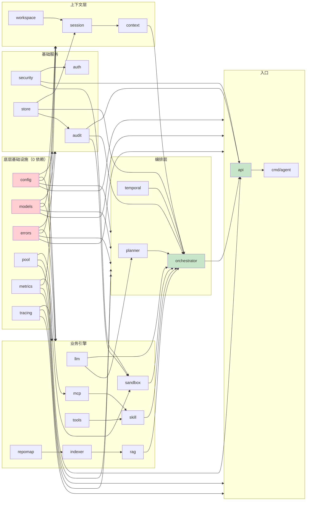

**原则**：箭头方向 = 依赖方向；**无循环**。

---

## 3. 数据流 ①：普通对话 `/chat` 完整生命周期

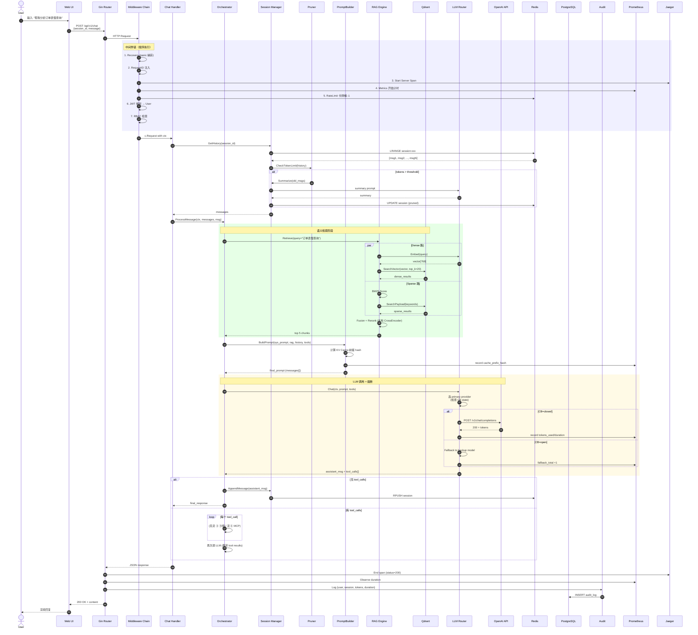

**关键点**：

- **3 个并行**：Dense/Sparse 双路检索可并行；Audit 写入异步；Metrics/Tracing 不阻塞主流程；
- **4 处 IO 优化**：Redis pipelining、Qdrant 批量查询、LLM streaming、Jaeger batch；
- **3 道闸门**：RateLimit（429）、Auth（401）、RBAC（403）；任一失败快速返回。

---

## 4. 数据流 ②：RAG 代码检索（双路召回）

```mermaid
graph LR
    Q[用户查询<br/>'订单慢查询'] --> QN[Query Normalizer<br/>去停用词/提取实体]

    QN --> Dense[Dense 路]
    QN --> Sparse[Sparse 路]

    subgraph DensePath["向量语义检索"]
        Dense --> Embed[Embedder<br/>OpenAI ada / Local TEI]
        Embed --> DVec[Query Vector<br/>768 dim]
        DVec --> DSearch[Qdrant<br/>cosine similarity<br/>top_k=20]
        DSearch --> DFilter[Payload Filter<br/>project='auth-service'<br/>version='v1.2']
        DFilter --> DRes[Dense Results<br/>20 chunks]
    end

    subgraph SparsePath["关键词精确匹配"]
        Sparse --> BM25[BM25 Scorer<br/>tf-idf]
        BM25 --> SSearch[Qdrant Text Index<br/>inverted index]
        SSearch --> SRes[Sparse Results<br/>20 chunks]
    end

    DRes --> Fusion[Reciprocal Rank Fusion<br/>RRF score = Σ 1/(k+rank)]
    SRes --> Fusion

    Fusion --> Merged[Merged Top 40]

    Merged --> Rerank[CrossEncoder Reranker<br/>bge-reranker-v2-m3<br/>本地部署]
    Rerank --> Final[Final Top 5]

    Final --> ContextAssembly[Context Assembly<br/>按依赖关系排序<br/>go imports → struct → func]

    ContextAssembly --> Out[RAG Context<br/>injected into prompt]

    subgraph Ingestion["⚙️ 入库流水线（异步）"]
        Files[代码文件<br/>*.go / *.py / *.md]
        Files --> Parser[tree-sitter<br/>AST Parser]
        Parser --> Chunks[Semantic Chunks<br/>func-level/class-level]
        Chunks --> Enrich[Enrich<br/>· comment<br/>· signature<br/>· dependencies]
        Enrich --> Embedder2[Embedder]
        Embedder2 --> Indexer[Indexer]
        Indexer --> Qdrant_W[(Qdrant<br/>upsert)]
    end

    Qdrant_W -.-> DSearch
    Qdrant_W -.-> SSearch

    style Dense fill:#e3f2fd
    style Sparse fill:#fff3e0
    style Fusion fill:#f3e5f5
    style Rerank fill:#e8f5e9
    style Ingestion fill:#fafafa,stroke-dasharray:5 5
```

**三层召回金字塔**：

- **召回**（Recall）：双路 → 40 个候选；高召回率；
- **排序**（Ranking）：RRF 融合 → Top 40 粗排；
- **重排**（Rerank）：CrossEncoder → Top 5 精排；精度 > 召回；

---

## 5. 数据流 ③：沙箱代码执行（SSE 流式）

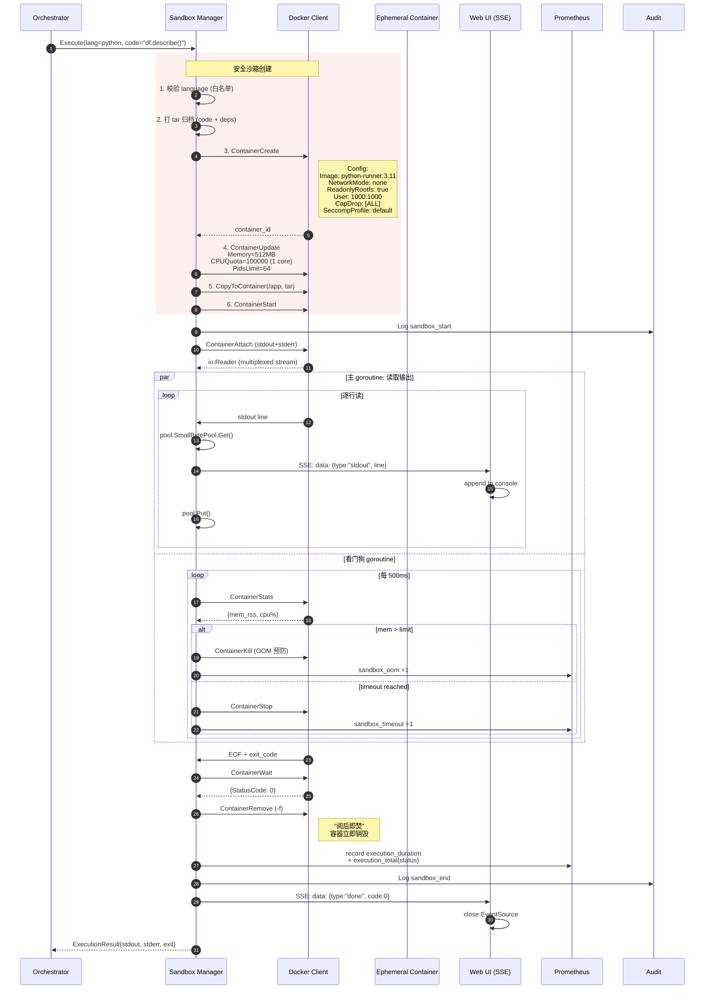

**5 层防御**：

1. **镜像隔离**：白名单基础镜像
2. **网络隔离**：`NetworkMode: none`
3. **文件系统隔离**：`ReadonlyRootfs`
4. **资源隔离**：cgroups limits
5. **能力隔离**：drop all caps + seccomp

---

## 6. 数据流 ④：HITL 人工介入（Temporal 挂起-唤醒）

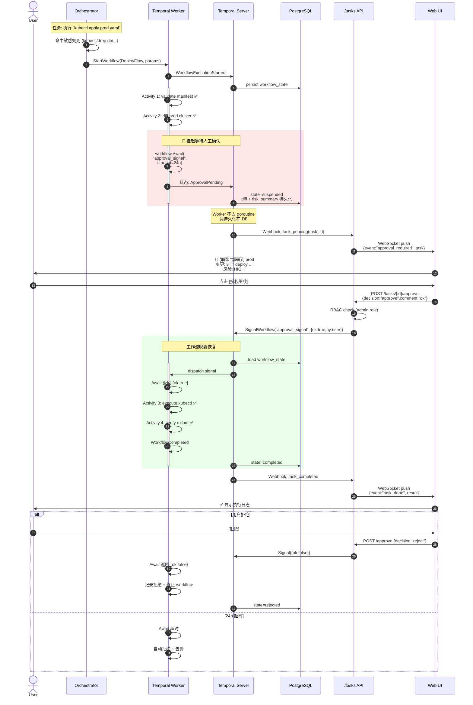

**关键设计点**：

- **Temporal Signal 是唤醒**，不是轮询 — 挂起时 0 资源占用；
- **workflow state 全持久化** — 服务重启、节点迁移都不丢；
- **超时兜底** — 防止遗忘审批导致 goroutine 泄漏；
- **审计全留痕** — 每次 approval/reject/timeout 都进 SIEM。

---

## 7. 数据流 ⑤：MCP 动态工具调用

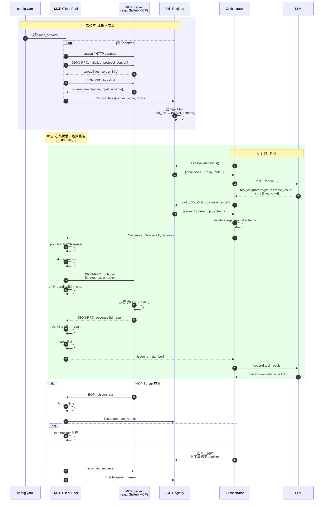

**4 个关键机制**：

- **启动时批量发现** → 构建工具内存表；
- **运行时零开销查询** → O(1) map lookup；
- **JSON-RPC 2.0 pending 表** → 并发请求复用同一 stdio 连接；
- **断线自愈** → 不影响其他 MCP server。

---

## 8. 数据流 ⑥：Session 上下文管理与压缩

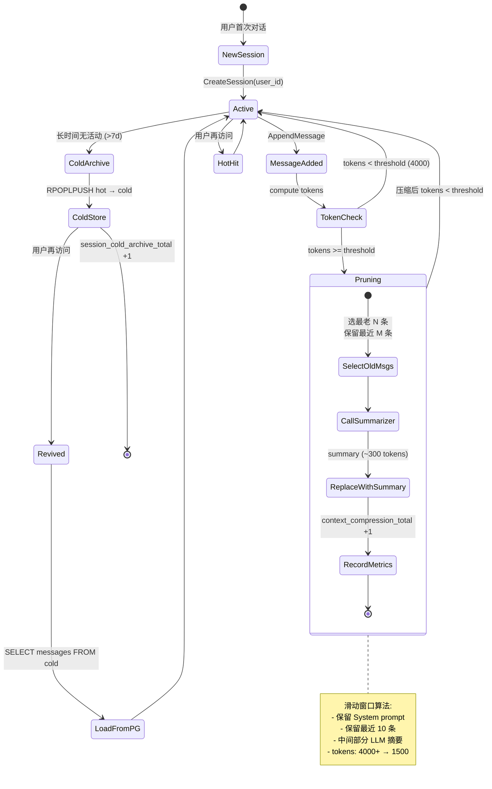

### Session 数据结构

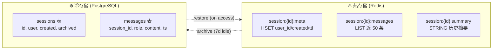

---

## 9. 数据流 ⑦：LLM 路由 + 熔断 + 降级

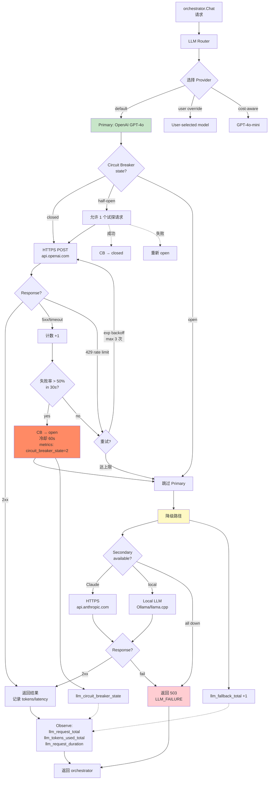

**三状态 Circuit Breaker**：

| State | 行为 | 条件进入 |
|---|---|---|
| **Closed** | 正常透传 | 成功率 ≥ 50% |
| **Open** | 全部拒绝（走 fallback） | 失败率 > 50% in 30s |
| **Half-Open** | 放 1 个试探 | open 冷却 60s 后 |

---

## 10. 状态机总览

### Task（Orchestrator 视角）

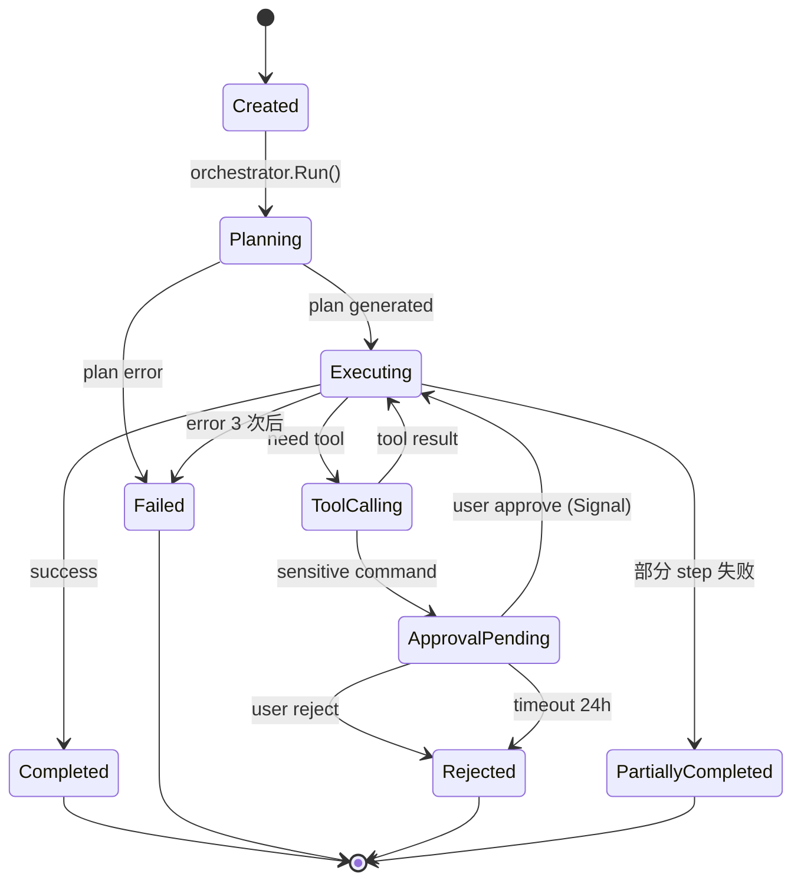

### Workflow（Temporal 视角）

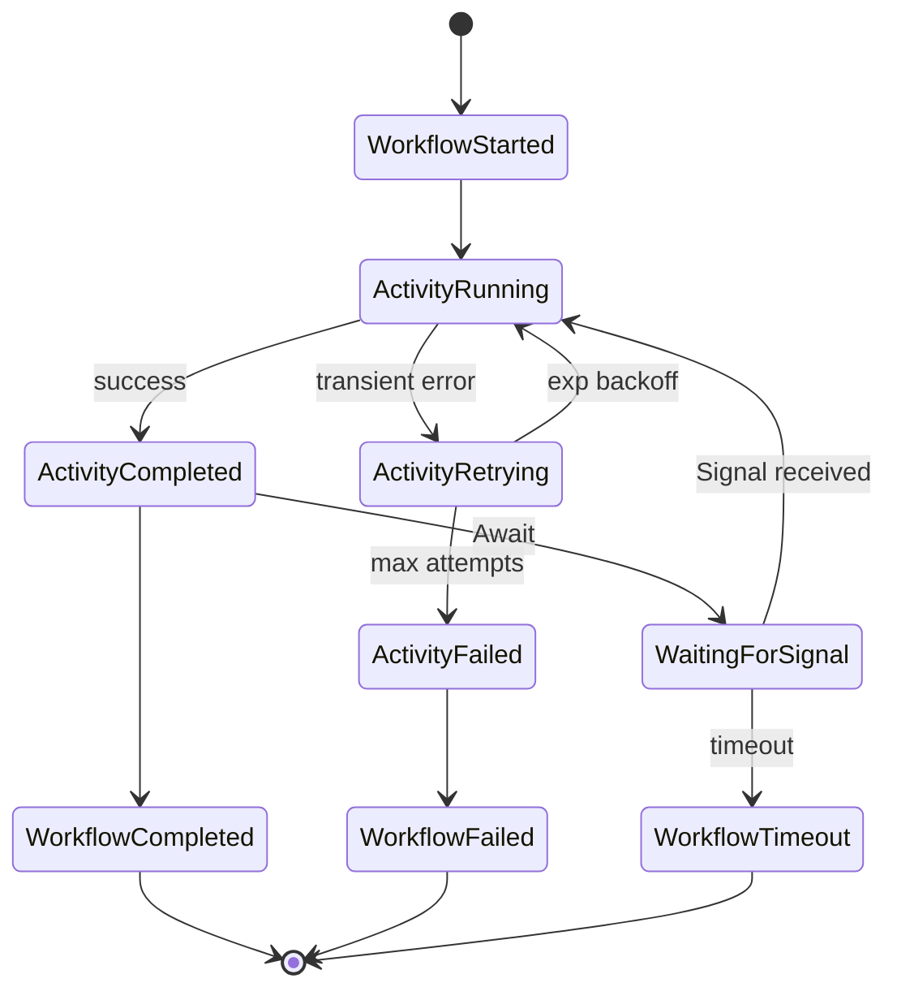

### Circuit Breaker（LLM 视角）

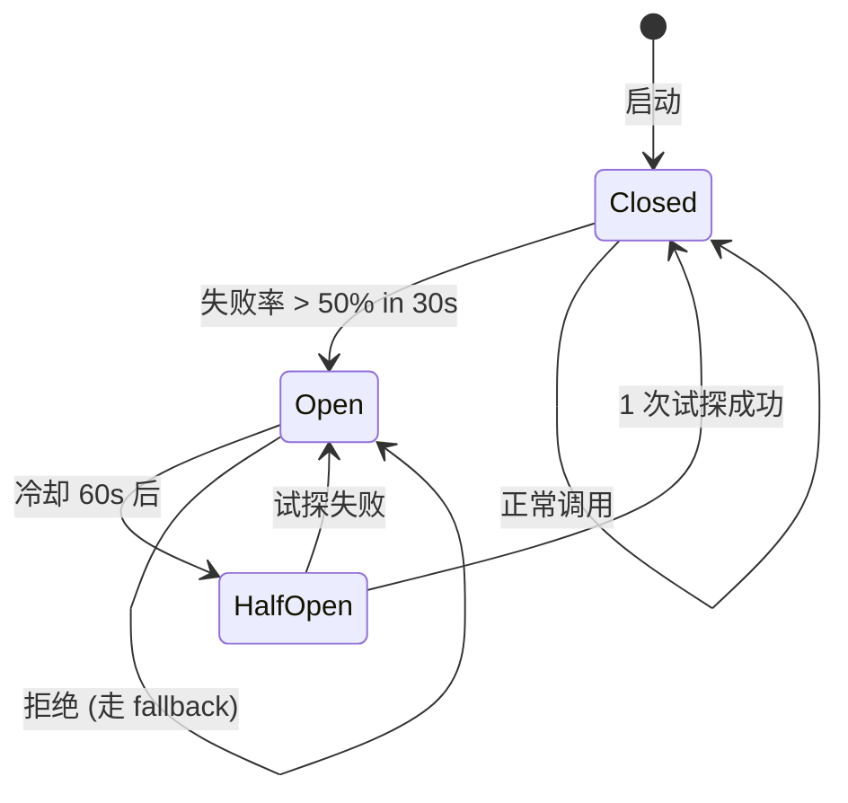

---

## 11. 部署拓扑图（K8s 生产）

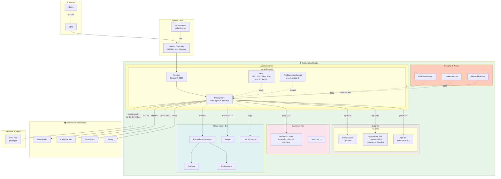

### 网络流量分类

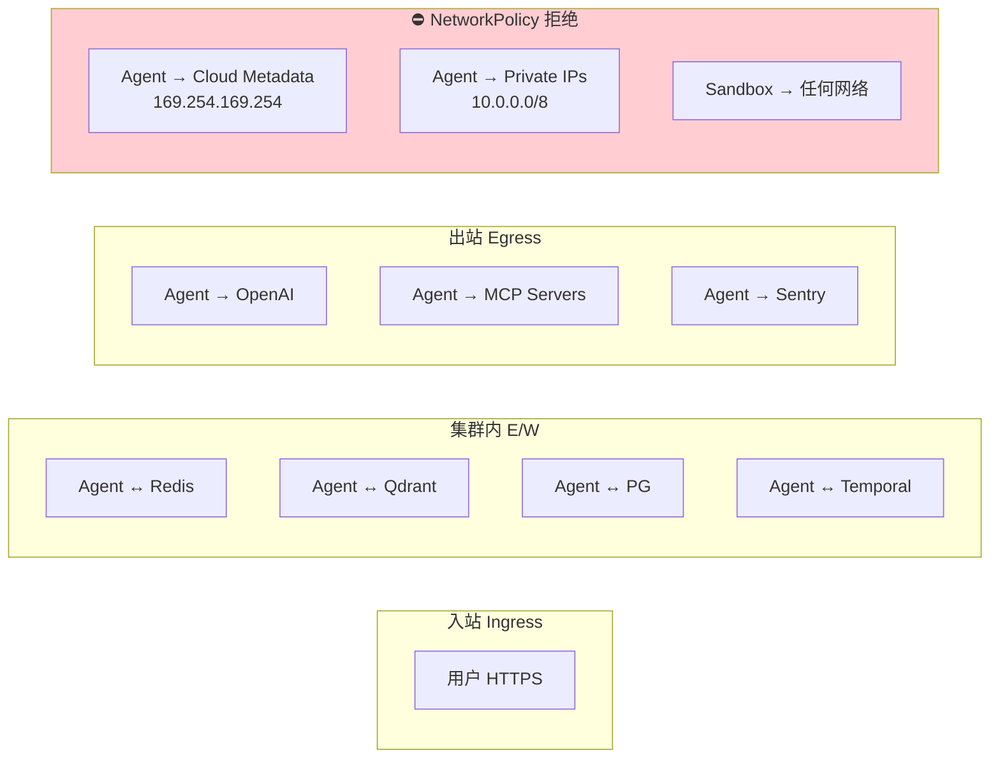

---

## 附：架构图索引

| 图号 | 标题 | 用途 |
|---|---|---|
| #1 | 分层系统架构 | 给 CTO/新人看全貌 |
| #2 | 模块依赖 | Go 包设计审查 |
| #3 | /chat 生命周期 | 排障 & 性能分析 |
| #4 | RAG 双路召回 | 检索质量优化 |
| #5 | 沙箱执行 SSE | 安全审计 |
| #6 | HITL 挂起-唤醒 | 合规场景 |
| #7 | MCP 工具调用 | 接入新外部系统 |
| #8 | Session 压缩 | 成本优化 |
| #9 | LLM 熔断降级 | 稳定性分析 |
| #10 | 状态机总览 | 协议文档 |
| #11 | K8s 部署拓扑 | 运维交付 |

---

**说明**：所有 Mermaid 图兼容：

- ✅ GitHub / GitLab README 直接渲染
- ✅ VS Code Mermaid Preview
- ✅ 语雀 / Notion / Confluence
- ✅ `mermaid-cli` 导出 PNG/SVG：
  ```bash
  npx -p @mermaid-js/mermaid-cli mmdc -i ARCHITECTURE_DIAGRAM.md -o out/
  ```
